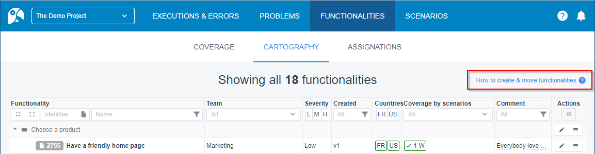
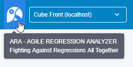
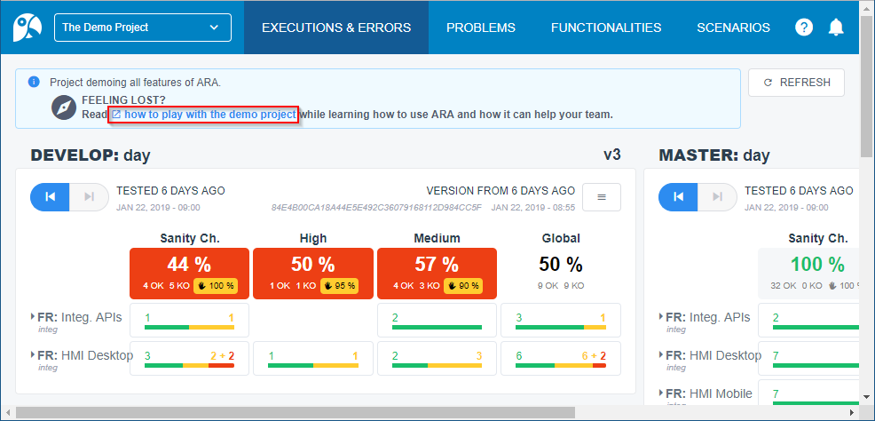
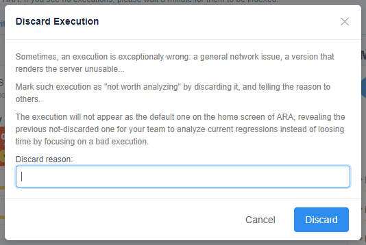
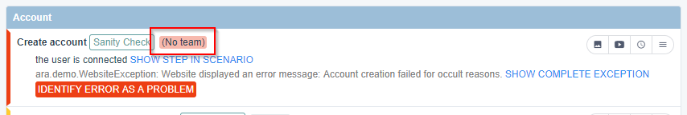
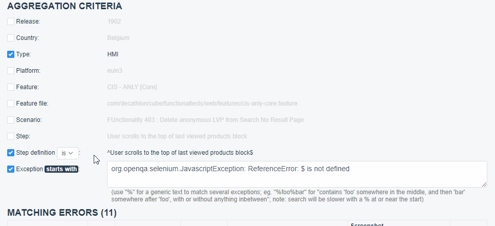

= ARA Change Log

NOTE: ARA is using Semantic Versioning: https://semver.org/ +

////
Notes to developers filling this file:

Do not forget to change the version number by running this in the root "ara-parent" project:
mvn -DnewVersion=X.Y.Z -DgenerateBackupPoms=false versions:set

Each line is preceded by either:
* [BREAKING CHANGE] for an incompatible API change (major version incremented)
* [FEATURE] for a new feature (minor version incremented)
* [FIX] for a backward-compatible bug fix (patch version incremented)

This changelog is both for developers and end-users. +
Please split changes in two categories:
* `User-Visible Changes`qsd dsq

When introducing a user-visible feature, please include a screenshot or an animated GIF. +
For instance, on Windows, you can use http://getgreenshot.org/ for screenshots
and https://www.screentogif.com/ for animated-GIFs.
////

== 3.1.1

== User-Visible Changes

* *[FIX]* Fix an issue which prevents the Demo project to be created.
* *[FIX]* Add a global skip tests when trying to build & run in 2minutes (README.adoc)
* *[FIX}* Fix a 404 link to the DemoWalkthrough in the Demo project.

== 3.1.0

== User-Visible Changes

* *[FEATURE]* Add support for GitHub issue tracker.

== Technical Changes

* *[FIX]* Fix an issue where a Swagger dependency can't be downloaded on first install.
* *[FEATURE]* Release ARA source code under Apache 2 license on Github :
https://github.com/decathlon/ara

== 3.0.1

=== Technical Changes

* *[FIX]* Fix a performance issue which prevents executions to display, and browser's tab
to freeze, when the execution have several errors with detailled exceptions.

== 3.0.0

First version of ARA with a release of the source code.

* *[BREAKING CHANGE]* Change the way the final jar is builded
* *[FEATURE]* Connect the project to Decathlon's internal CI.

=== Technical Changes

* *[BREAKING CHANGE]* Change the way the final Executable is builded.
* *[FEATURE]* Add the integration to Decathlon's internal CI.

== 2.4.3

=== Technical Changes

* *[FIX]* Remove hardcoded url in documentation from the Front.
* *[FIX]* Remove useless logs due to conflict between file system indexer and old one.
* *[FIX]* Logs the state change of a feature flipping.

== 2.4.2

=== Technical Changes

* *[FEATURE]* Add a Feature Flipping mechanism, component and API to prevent unstable features to
    break the production.
* *[FIX]* Extract app specific configuration outside the sources to be easily included.

== 2.3.0 (released on February 15, 2019)

=== User-Visible Changes

* *[FEATURE]* Added help documentation on how to create and move functionalities and folders: +
  

== 2.2.4 (released on January 13, 2019)

=== Technical Changes

* *[FIX]* Another regression since 2.2.0: demo executions were not indexed anymore

== 2.2.3 (released on February 13, 2019)

=== Technical Changes

* *[FIX]* Updated documentation on how to install ARA

== 2.2.2 (released on February 12, 2019)

=== Technical Changes

* *[FIX]* Another regression since 2.2.0: at execution completion request, two threads were trying to index same data

== 2.2.1 (released on February 12, 2019)

=== Technical Changes

* *[FIX]* Regression since 2.2.0: failing execution indexing, resulting in missing or stale executions in ARA
* *[FIX]* Removed a useless (but harmless) execution folder deletion by the file system indexer (with a WARN log)

== 2.2.0 (released on February 11, 2019)

=== User-Visible Changes

* *[FEATURE]* The ARA-logo in top-left menu-bar is now clickable to go to homepage of the default project: +
  
* *[FEATURE]* The demo project is now complete, with coherent data, and with a user documentation linked on the homepage
  of the demo project in ARA:
  
* *[USABILITY]* The "DISCARD EXECUTION" dialog now explains what is this feature and how/when to use it: +
  
* *[USABILITY]* In execution screen, show a red "[ No Team ]" tag on scenarios without functionalities
  (thus without team): +
  

== 2.1.0 (released on February 7, 2019)

=== User-Visible Changes

* *[FEATURE]* The defect tracking system can be disabled for a project, if defect IDs are linked to no defect tracking
  system, or a currently-unsupported-by-ARA one

== 2.0.0 (released on February 6, 2019)

=== Technical Changes

* *[BREAKING CHANGE]* Remove the SSH or direct access to upload executions reports replaced by a HTTP endpoint.
* *[BREAKING CHANGE]* Index immediately execution reports when uploaded with the HTTP endpoint

== 1.0.1 (released on January 29, 2019)

=== User-Visible Changes

* *[FIX]* Some very old non-reappearing-CLOSED problems where counted as SUCCEED instead of HANDLED in run's severity bars

== 1.0.0 (released on January 15, 2019)

=== User-Visible Changes

* *[FEATURE]* "Scenario", "Step" and "Step definition" criteria can now optionally be matched by "starts with" instead
  of "is": +
  

=== Technical Changes

* *[BREAKING CHANGE]* Starting version numbering, as ARA now has a public library
* *[FEATURE]* Added the `ara-lib` dependency to include in projects to help them:
  ** extract Cucumber step definitions into a stepDefinitions.json for ARA
  ** create structured embeddings to embed in Cucumber reports for ARA
  ** parse structured embeddings for analysis purpose
