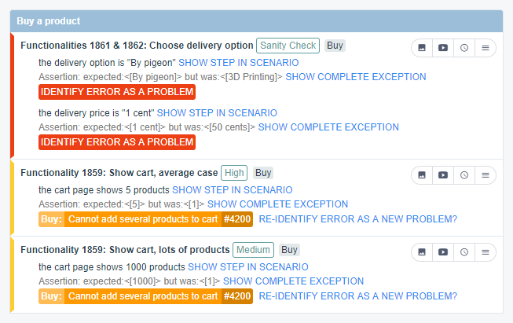

=  ARA - Agile Regression Analyzer

== What is ARA?

ARA helps to fight against regressions all together.

=== Helping your Team to Identify Business Problems Among Many Raw Regression Errors

You have a big corporate project. +
You have automated tests with Postman or Cucumber (with Selenium, RestAssured, or others...) or even Karate. +
You cannot afford waiting for your tests to run in order to approve merge requests (too much to run, too long to deploy...). +
Your automated functional non-regression tests are then executed after a delay, from your main development branches. +
This produces a lot of errors that could be regressions as well as false-positives. +
ARA will help you filter out real business problems out of this mess, for your team to fix them quicker.

=== How Does it Work?

Send your non-regression-tests reports to ARA and it will display them. +
ARA is an expert system: your team will create rules to aggregate all similar technical errors as problems. +
Basically, you create rules to correlate all symptoms of the same problem's root cause. +
You then create defects in your bug-tracking-system and assign these defects to ARA problems for you to follow the resolution advancement.
In the meantime, when problems are appearing recurrently, ARA will automatically detect the problems that the team has already addressed, thanks to the rules they created. +
As a result, new errors will stand out, so you can solve them more quickly, and recurring errors will not bother you while they are in the process of being fixed:

 +
Here, the orange error has been recognized: you only need to manage the two new red errors.

=== Requirements

You only need a report.json from Cucumber and/or one or several JSON reports from Newman.

ARA integrates best with a working Continuous Integration pipeline which launches your tests automatically (on a time-schedule or after each commit). +
You will then modify your pipeline slightly to send such report files to ARA.

== How to build it and make it work in 2 minutes

After you've download the source code of ARA, here is all you have to do to make it run on your local environment. You will
need :

* Java 8 (for now, supports for more recent Java versions will come soon).
* Maven 3
* Docker
* A shell environment (either Bash, Sh, Zsh..., or even a git-bash on Windows)

In the following, the folder which contains this Readme will be called `ARA_ROOT`

. Create a folder where your database's datas are going to live (says `my/db/path`)
. Open a Terminal, and go to `ARA_ROOT/db`
. Use `./manage-db.sh create my/db/path`, this command will create a MySQL Dockerized database locally.
. In the terminal, go back to `ARA_ROOT`` and a `mvn clean install -Pdev -DskipPitest -Dmaven.test.skip=true`
. Go to `ARA_ROOT/final/target` and run `java -Dspring.profiles.active=dev -jar ara-{{YOUR_VERSION}}.jar`

== How to Set Up ARA?

Please read the <<doc/integrator/main/IntegratorDocumentation.adoc#head, Integrator Documentation>>
to learn how to set up ARA, configure it, and plug the continuous integration of your project onto ARA.

== How to Use ARA?

Once your technical team did plug the continuous integration of your project onto ARA,
read the <<doc/user/main/UserDocumentation.adoc#head, User Documentation>>
to train your whole team to use ARA.

== How to Develop ARA?

Please read the <<doc/developer/DeveloperDocumentation.adoc#head, Developer Documentation>>
to learn how the project is structured and how to develop new features in ARA.
