= Demo Walk-Through

By following this walk though the demo project embedded in ARA, you will:

* learn what is ARA,
* discover how it can help your team,
* be suggested what to try while playing with the demo project to discover a user journey,
* the walk-through can serve both as user training material, or as information to decide if you need ARA.

== (Re-)Create the Demo Project

Don't fear to mess up with demo data: you can delete and recreate the demo project at any moment:

image:create-demo-project.png[]

== The Structure of the Demo Project

The demo project is configured as follow in ARA:

* It has two Git branches:
  ** *master*: the version in production (or about to be)
  ** *develop*: the branch where new features appear
* Tests are run on two countries: *FRance* and *United States*:
  most test scenarios are common to both countries, but some are country-specific
* There are several test types:
  ** *Integration API* tests using Postman
  ** *HMI* tests (using Selenium) are executed twice per country:
     on both *Desktop* Firefox and *Mobile* Firefox, to check responsiveness
* All tests are run on master for each commit,
  as well as on develop during the night;
  but since tests are quite long to run, only a sub-set of them are run during the day on develop,
  for fast results on each commit

=== Understanding the DEVELOP:night and MASTER:day Executions

NOTE: On the home screen, **DEVELOP: day** is a very simple test cycle with only one Postman and one Web run. +
You can focus on it while discovering ARA: you will explore **DEVELOP: night** later. +
Skip to the next paragraph if you like.

ARA allows you to group several test runs into the same execution, and provide a quality result for the whole. +
The **DEVELOP: night** cycle present a very complete example of how complex a project can become, and still be supported
by ARA.

Tests are run twice: for France and United States:

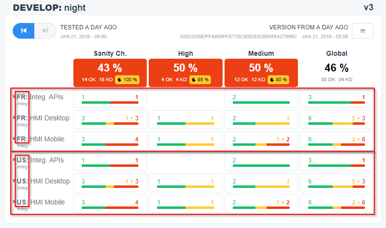

For each country, there are API tests, as well as Web HMI tests:

image:develop-night-api-vs-web.png[]

And all HMI/Web scenarios are executed both on a Desktop browser and on a Mobile one:

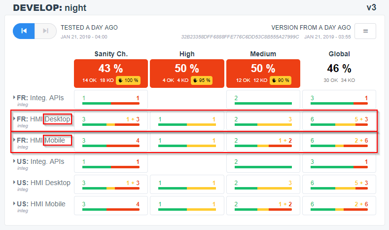

== Play With the Demo Project

Here, we will follow a typical user journey to understand how to exploit automated tests results with ARA.

=== View Functionalities

Before diving into the automated test execution results, you can go to the Functionality Cartography to become more
familiar with the business functionalities of the demo project:

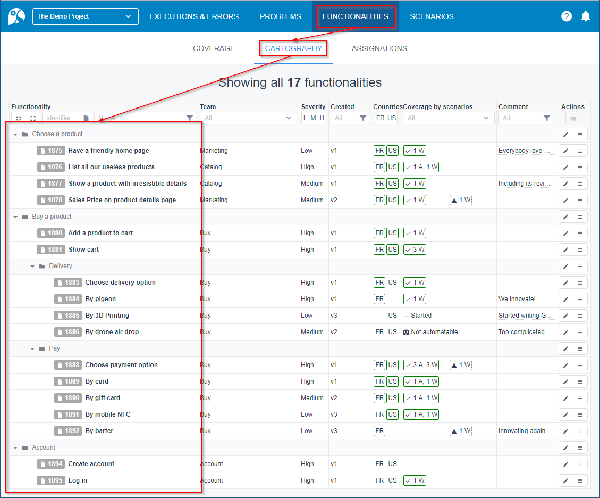

This screen lists all functionalities of the project, be them tested by automatic or manual tests. +
The demo project is a fake e-commerce website, where it's important to choose a product amongst a listing, add it to a
cart, choose a delivery option, a payment option, pay, and be able to create an account and log in with that account. +
Most of these functionalities will be tested by Cucumber scenarios and Postman requests.

=== View Executions

A test scenario have three statuses:

* **Green:** the scenario succeed
* **Red:** the scenario failed, with a new error that nobody analyzed yet
* **Orange:** the scenario failed, but with a known business problem:
  someone created a rule to handle one or several errors plagued by the same business problem
  (regression or test to update): ARA will recognize the same problem as long as it happens during test executions.

When new technical errors appear, they are flagged red, and the team's goal is to identify the cause and create a
problem with one or more rules for ARA to automatically recognize this error and all its occurrences (same error in
several scenarios, in several countries, in several executions...).

=== Create & Edit Problems

==== Create Problem 1: "Payment failure"

In the `Pay` feature, you notice three scenarios ending with the failed step `the order is accepted`,
with the same exception `NotFound: Cannot locate {By.cssSelector: #order-confirmation}`. +
This has to be the same error, so you investigate and click the red `IDENTIFY ERROR AS A PROBLEM` button:

image:problem-1-01.png[]

You evaluate the screenshot, and the video of the failed scenario. +
There seems to be a regression: payment is not possible anymore. +
There is a defect to create, but first, you need to pinpoint all occurrences of the problem in ARA,
for other members of your team to benefit from your analysis: +
The aggregation criteria that ARA propose you by default already find 9 errors matching these criteria in the present
and past executions:

image:problem-1-02.png[]

Try to uncheck or check some criteria and/or modify their value to try to aggregate even more errors that have the same
root cause and that can be aggregated with the same defect.

You will find that un-checking the "Type: HMI Desktop" checkbox, the matching error count rises to 15. +
This is because the same scenarios are executed on a desktop Web browser *and* on a mobile Web browser, but the failure
is server-side and thus occurs in both occasions. +
You evaluate logs, screenshots and videos of the found errors:

image:problem-1-03.png[]

You then find all errors are really the same underlying problem. +
The criteria design phase is now complete: scroll down and create a problem by filling the fields:

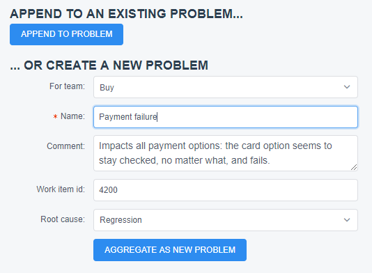

And now, the problem is attached to all these error occurrences:

image:problem-1-05.png[]

==== Attach Other Patterns to Problem 1

Since problem we just created seems to denote a server-side regression,
you look at the API tests to see if the problem happened here too. +
Bingo:

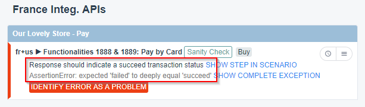

You click the red `IDENTIFY ERROR AS A PROBLEM` button. +
This time, the default criteria are self-sufficient, so you do not modify them. +
At the end, this time, you will choose `APPEND TO PROBLEM` to append the given criteria to the previous problem:

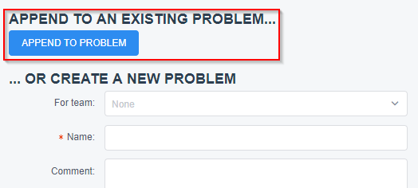

And click the `APPEND TO` button in front of the problem we created:

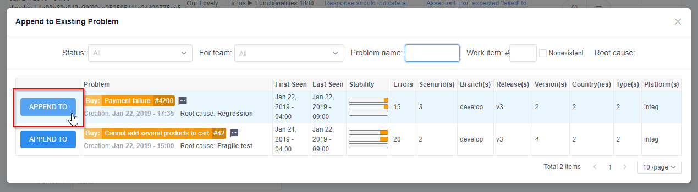

==== View Problem Details

You are ready to visualize the problem we created: just click on the orange tag of the problem, anywhere it appears:

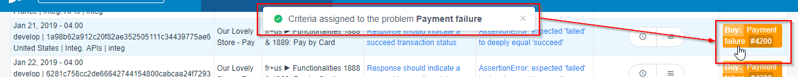

Here are all details of a problem:

image:problem-1-10.png[]

* The problem has a name, and can be assigned to a team: this team is responsible to solve it
* The problem can be associated with a defect ID from your defect management system: if supported, changing the status
  of the associated defect in your defect management system will close/reopen the problem in ARA
* You can add a comment to tell people more details about what this problem is about
* Once you know what was the root cause of the problem, you can fill the root cause field for statistics
* Under STATISTICS, you can see:
  ** when did the problem first and last appeared
  ** there are one stability bar per cycle (develop/day, develop/night, master/day), showing the last ten executions:
     one orange or red square means the problem appeared in this execution, and a gray one means the problem did not
     appear. Not appearing does NOT mean the problem is solved: the rules associated to the problem can match last steps
     of a scenario, and this scenario can now fail earlier, not executing the rest of the scenario, and thus hidding the
     information if the problem still appears or not
  ** next column list the number of error occurrences
  ** next columns list where the problem did appear: in which scenario(s), branch(s), version(s)s, country(ies), test
     type(s) and platform(s): either the distinct count is shown, or the value if only one distinct value. In the
     example, the problem appeared on 4 distinct scenarios, but always on the develop branch...
* Under PATTERNS, you can see the rules that are applied to automatically recognize the problem. They are editable.
* Then, all matching errors are displayed, so you can check details of each individual technical error.

==== Create Another Problem: "Delivery selection is not working"

You notice another unhandled error (in red) in the latest execution of `DEVELOP: day`:

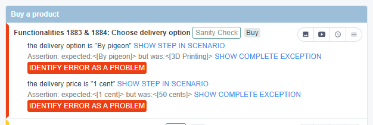

This scenario have two errors, because of two failed steps (this is common on Postman requests, too). +
You only need to identity one error per scenario with a problem. +
If a scenario is assigned one known problem to it, then the scenario is considered "handled"
and all remaining red errors (without any attached problem) are considered side-effects. +
Note: if you really see two different errors on a scenario, you *can* assign two problems.

Here, the delivery selection does not work anymore. +
And the delivery price being wrong is a side-effect of that problem. +
Click the red `IDENTIFY ERROR AS A PROBLEM` button on the first error.

Again, un-check `Type: HMI Desktop`, as this is happening on mobile too.

Either keep the criteria as they are, to only identify the first error... +
Or change `Step definition:` to `starts with`
and replace `^the delivery option is "([^"]*)"$` by just `^the delivery` to match both steps
and put `%` onto changing data in the exception:

image:problem-2-02.png[]

and you will get 20 errors instead of 10: matching both failed steps:

* `the delivery option is "By pigeon"` / `expected:<[By pigeon]> but was:<[3D Printing]>`
* `the delivery price is "1 cent"` / `expected:<[1 cent]> but was:<[50 cents]>`

Create the problem:

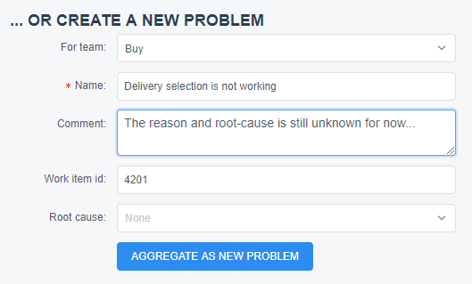

And go back to the execution screen. +
Depending on the criteria you used, you will see either the two-errors version:

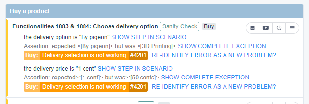

Or the single-error version:

image:problem-2-05.png[]

The red button is grayed out, meaning the error does not have to be identified with a problem
(but it still can, if needed). +
In both versions, the scenario as a whole has an orange left-bar, indicating the scenario is handled. +
This scenario handling state is reflected on the execution summary:

image:problem-2-06.png[]

The orange bars are the same in the two versions of the problem.

Well, so we see only two scenarios have not been analyzed yet: let's discover why they failed!

==== [[create-last-problem]] Create our Last Problem: "Log in not working anymore"

On the last unhandled two scenarios, account creation and log in fail for occult reasons. +
You can create two problems if you are not sure. +
But let's assume we talked with the developers, and they see clue in the logs that it's the same regression. +
Let's then create the last problem that encompass both "Account creation failed for occult reasons." and
"Log in failed for occult reasons." error messages:

image:problem-3-01.png[]

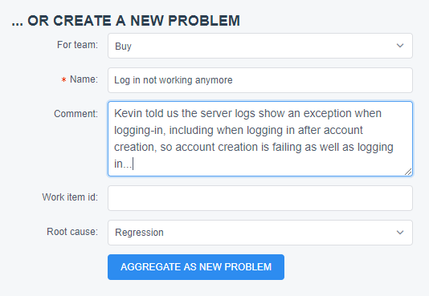

Congratulation: everything is orange instead of red: with only three newly created business problems,
the nine failed scenarios are now covered by a defect, and your developer team will be able to fix these regressions.

image:problem-3-03.png[]

*That's the main purpose of ARA: work together as a team to aggregate all symptoms of a regression into one defect, and
recognize the known problems as they reappear in next automated-test executions, while waiting for the regressions to be
fixed. On later executions of your tests, the criteria/patterns you defined will be evaluated, errors will automatically
be assigned with the problems you created, and new regressions or unseen errors will stand out in red!*

In an execution, you can also see a summary of current problems:

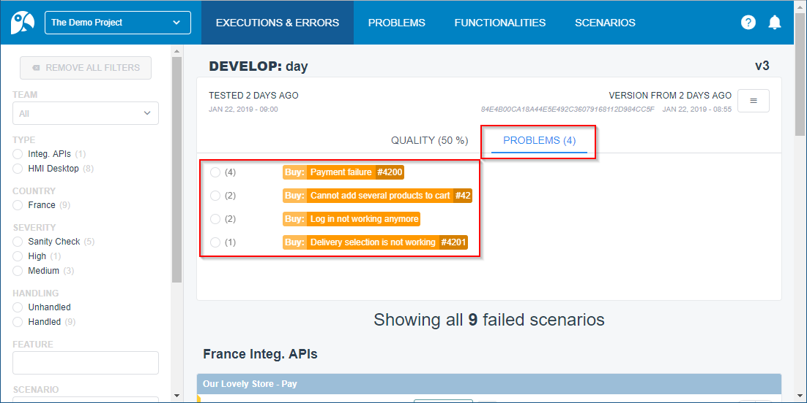

They are ordered by decreasing impact for you to prioritize problem resolutions:
the first problem is occurring in 4 scenarios in the current execution, and is thus the most important. +
Clicking the radio button in front of the problem will allow you to filter and only show impacted scenarios in the
current execution.

==== Edit a Problem

Kevin was wrong: log in and account creation are not the same issue (see <<create-last-problem, previous section>>). +
We will edit the pattern of our previous problem to be more restrictive, so we can create another separated problem.

In the PROBLEMS screen, click our problem:

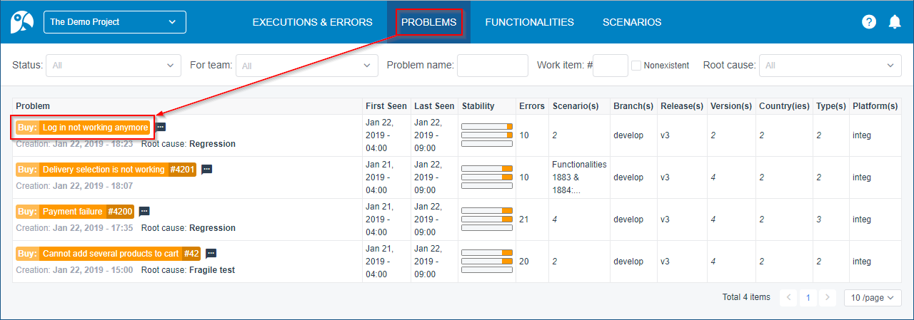

In the PATTERNS section, click the blue menu on the pattern, and choose EDIT PATTERN:

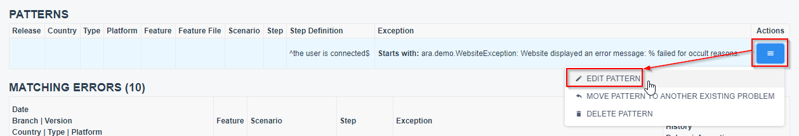

Since the problem name is "Log in not working anymore", we will restrict the pattern to match only log in failures,
and will keep the account creation failures for another problem to be created.

Replace the "%" in the exception by "Log in", so the matching errors goes from 10 to 5:

image:edit-problem-03.png[]

Save the pattern.

In the execution, you are back with one red scenario: create a new problem for it, and you are done.

==== Reappearing Problems

If you choose to link ARA problem statuses to the defects in your defect tracking system,
problems with defect IDs will be automatically closed or reopened when the corresponding defect is closed or reopened.

If ARA problems are not linked to a defect tracking system or have no defect ID, you can close and re-open ARA them
manually.

If a problem is closed but reappear in a later execution, it becomes red (unhandled) and the associated scenarios are
thus potentially requiring a manual action:

image:reappearing-problem-01.png[]

Here, even tough the scenario has an associated problem, the scenario is unhandled/red because the problem reappeared in
an execution that ran *after* the problem was closed. A closed problem is supposed to be fixed, so if it reappears
afterward, there is something wrong: a manual action is thus required. Click the problem name to see more information
about what to do:

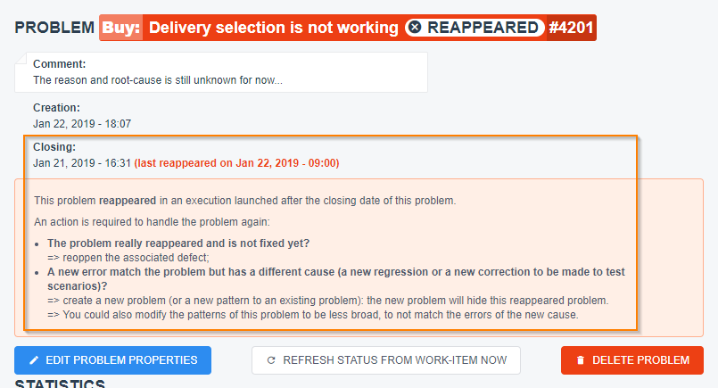

Namely: if ARA is linked to your defect tracking system, you have to re-open the defect; and if not, you can directly
re-open the problem in ARA. If the symptoms of the problem reappeared for another reason, you can create another
problem, or modify the patterns of another existing problem to match this exception too.

== Going Further

Follow the link:../user/main/UserDocumentation.adoc[user documentation] to learn about other features of ARA,
like the functionality coverage.
