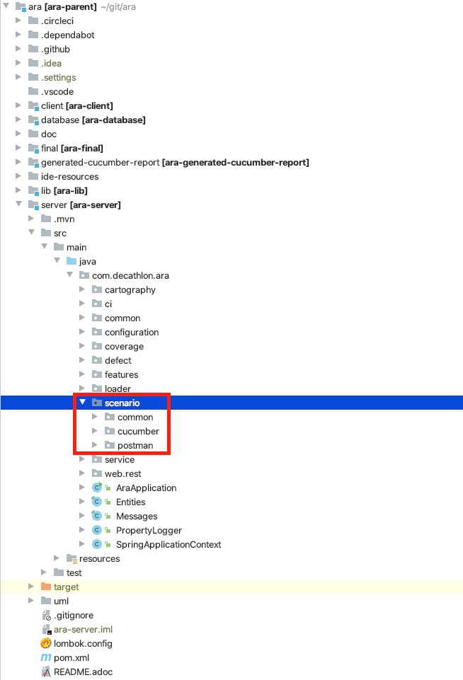

= Adding a new testing framework

Before reading this section, it is advised to read first <<../uploads/HowItWorks.adoc#head, how ARA executions works>>. +
This documentation aims to show how to contribute to ARA by adding a testing technology that isn't yet supported. +
Note: Your ARA version must be at least 5.0.0

== What and where should I add my contribution ?

In order to add your contribution to ARA, you'll need to know where to apply it.
Below is what you need to add or update:

=== The code

. *Package*: +
The test scenarios processing are divided into multiple packages depending on the technology used.
You can find them in the package `com.decathlon.ara.scenario` (in the `*[ara-server]*` module). You can then create here a new package with the name of the technology you want to implement, next to the already existing ones. +
Bear in mind that it is required for the package name to be in lowercase.
+

In order to respect the project homogeneity, it is highly recommended keeping the same package structure.
. *Indexer*: +
Once the package created, you can add a scenario indexer, i.e. the code that will turn your raw executed test results files into objects that ARA can use.
Create a class that implements `com.decathlon.ara.scenario.common.indexer.ScenariosIndexer` and implement the method,
+
[source,java]
----
List<ExecutedScenario> getExecutedScenarios(File parentFolder, Run run, Long projectId);
----
You can take a look into the *Postman* (`com.decathlon.ara.scenario.postman.indexer.PostmanScenariosIndexer`) or *Cucumber* (`com.decathlon.ara.scenario.cucumber.indexer.CucumberScenariosIndexer`) scenario indexer to have an idea about the implementation.

. *Technology enum*: +
Once the scenario indexer is implemented, you now need to add the new `Technology` to the available technologies.
+
[source,java]
----
include::../../database/src/main/java/com/decathlon/ara/domain/enumeration/Technology.java[]
----

. *Strategy class*: +
You now need to let your code know which indexer to choose depending on the technology.
The design pattern strategy solves this problem.
Update the
+
[source,java]
----
public Optional<ScenariosIndexer> getScenariosIndexer(Technology technology);
----
method in the `com.decathlon.ara.scenario.common.strategy.ScenariosIndexerStrategy` class.
You can add a `case` statement to the `switch` to match the technology you've just added to choose the newly implemented indexer.

=== The settings

If the technology you are adding relies on some specific settings, you need to create an enum, following the rules below:

* The location: Create a package settings in your technology package. +
For instance, the Cucumber settings package is -> `com.decathlon.ara.scenario._cucumber_.settings` (in the `*[ara-server]*`). +
It is important the technology name in the package should be the same as the one in the technology enum but in lowercase, otherwise it won't be taken into account when processing the settings.
* The name: Once the package created, add an enum within. The name has to be as follows: +
The same name as the technology enum but only the first letter capitalized, concatenated to the word `Settings`. For instance the Postman settings enum is named -> `PostmanSettings`
* The type: This enum is required to implement the interface `com.decathlon.ara.scenario.common.settings.AvailableTechnologySettings`.

It is important to follow these rules for the settings to be processed by ARA.

=== The database

* Adding types: Before processing your executed scenarios tests results, ARA needs to link the `type` folders name with the existing types saved in the database.
A technology has one or more types and each `type` is linked to a `source`. Insert the corresponding types and sources matching your project and technology.
* Add to the `technology_setting` table any custom technology setting value. The technology should match the Technology enum, and the code the one you added to the enum previously created. +
Note that if you just updated ARA, the table `technology_setting` may not exist. In this case, you can run the queries below:
+
[source,sql]
----
-- 1- Create the table
DROP TABLE IF EXISTS `technology_setting`;
CREATE TABLE `technology_setting` (
  `id` bigint(20) NOT NULL AUTO_INCREMENT,
  `project_id` bigint(20) NOT NULL,
  `code` varchar(64) COLLATE utf8_unicode_ci NOT NULL,
  `value` varchar(512) COLLATE utf8_unicode_ci DEFAULT NULL,
  `technology` varchar(16) COLLATE utf8_unicode_ci NOT NULL,
  PRIMARY KEY (`id`),
  UNIQUE KEY `unique_technology_setting` (`project_id`,`code`,`technology`),
  CONSTRAINT `fk_technology_setting_projectid` FOREIGN KEY (`project_id`) REFERENCES `project` (`id`) ON DELETE CASCADE
) ENGINE=InnoDB AUTO_INCREMENT=10 DEFAULT CHARSET=utf8 COLLATE=utf8_unicode_ci ROW_FORMAT=DYNAMIC;

-- 2- Copy the previous settings
insert into technology_setting (project_id, code, value, technology) select project_id, 'report.path' as code, value, 'CUCUMBER' as technology from setting where code = 'execution.indexer.file.cucumberReportPath';

insert into technology_setting (project_id, code, value, technology) select project_id, 'step.definitions.path' as code, value, 'CUCUMBER' as technology from setting where code = 'execution.indexer.file.cucumberStepDefinitionsPath';

insert into technology_setting (project_id, code, value, technology) select project_id, 'reports.path' as code, value, 'POSTMAN' as technology from setting where code = 'execution.indexer.file.newmanReportsPath';
----

=== The documentation

It's your turn to document how to use your test framework results! +
In the `doc` folder in your ARA project, add your documentation in the `uploads` directory.
If you want an idea on how to write it, you can check the <<../uploads/UploadPostman.adoc#head, Postman>>, <<../uploads/UploadCucumber.adoc#head, Cucumber>>, or any other test framework related documentation. +
If there are any settings to take into account, do not forget to explain what there are and what they refer to.

== Thank you for contributing to ARA!