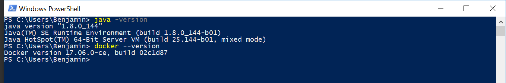
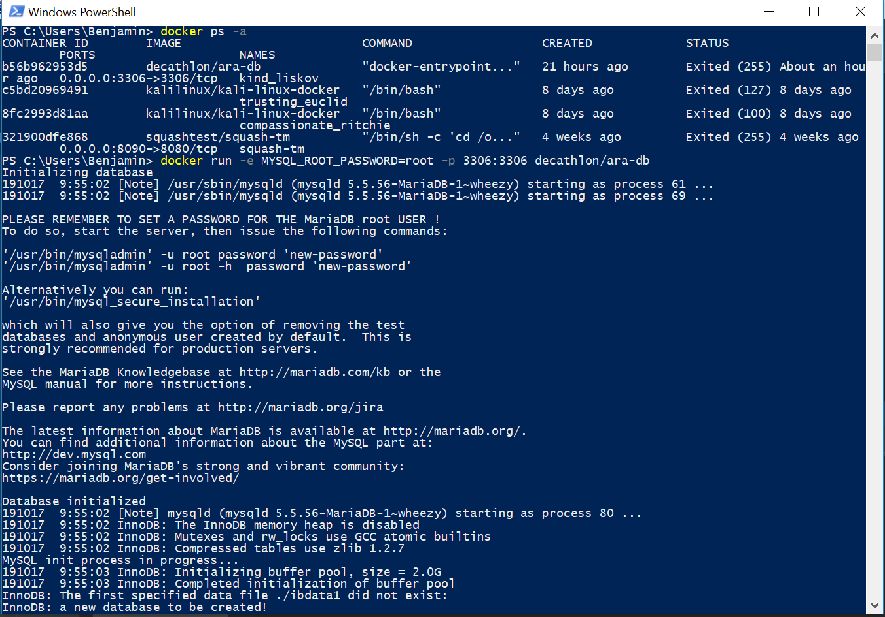
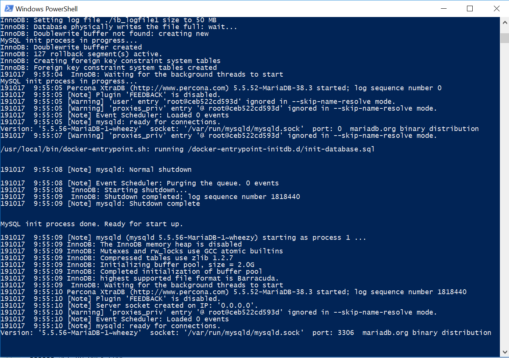
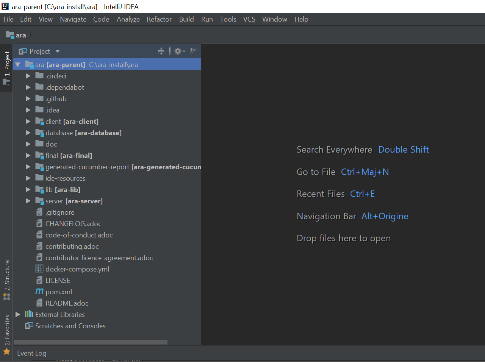
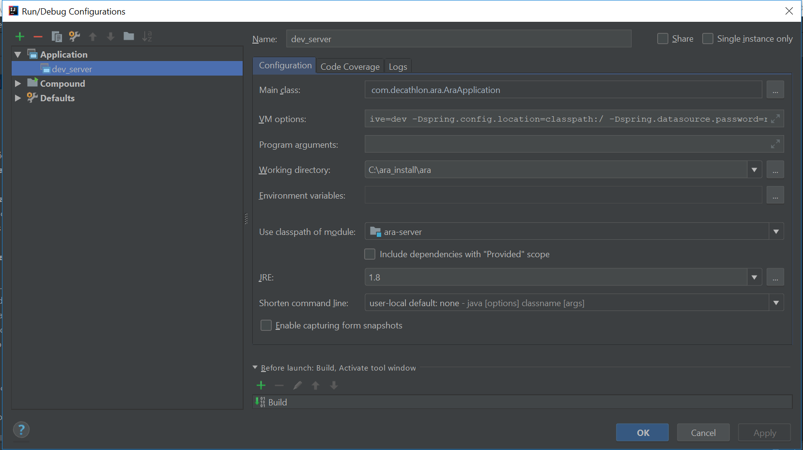
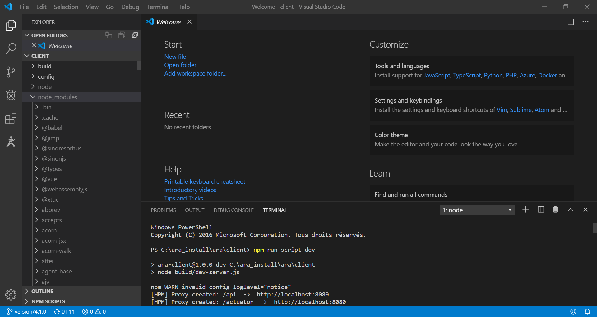

 ## Installing ARA for development

 ### Install the required tools
 
 + Install the following:
   + Java 8
   + Maven
   + IntelliJ Idea (_back development_)
   + Visual Studio Code or IntelliJ / WebStorm Idea Ultimate Edition (_front development_)
   + Docker
   + Git

 + Then verify that they are successfully installed:
   + Java `$ java --version` (the version should be Java 8)
   + Maven `$ mvn --version` (the displayed Java version should be Java 8)
   + Docker `$ docker --version` 
   + Git `$ git --version`  
   
 

 ### Get the source code

 `$ mkdir '<WORKSPACE_PATH>'`, if it doesn't exist
 `$ cd '<WORKSPACE_PATH>'`
 `$ git clone https://github.com/Decathlon/ara.git`

 ### Set up the database

 + Run this command line : `$ docker run -e MYSQL_ROOT_PASSWORD=yourDatabasePassword -p 3306:3306 decathlon/ara-db` 
 + Check that your docker database image is up: `docker ps`
 
 

 ### Set up the back environment

 1. Open IntelliJ 
 2. Choose the `Import a project` option
 3. Select the ARA project location path (`<WORKSPACE_PATH>/ara`), previously imported from Github
 
 4. Import the project as a Maven project
 5. Enable the recursive search of subprojects and auto imports
 6. Confirm
 7. Install those plugins: 
    + `Lombok`
    + `Cucumber for Java`
    + `Gherkin (Java)` (do not forget to enable Annotation processing)
 8. In `File -> Project Structure...`, select the `cucumber-generated-reports` project and make sure the path `target/generated-resources` is declared as a Resource folder and not an excluded folder.
 9. Launch the command `$ mvn clean install` on the following subprojects (the order matters) : `ara-lib` and `ara-cucumber-generated-reports`

 10. (_Optional_) Add settings parameters to `Run Configuration` :
   + Main Application : `com.decathlon.ara.AraApplication`
   + VM Options: `-Dspring.profiles.active=dev -Dspring.config.location=classpath:/ -Dspring.datasource.password=<YOUR_DB_PASSWORD>`
   + Classpath of module: `ara-server`
   + JRE: 1.8
 

 ### Set up the front environment

1. Having already downloaded Visual Studio Code, add the following plugins:
   - npm plugin (https://marketplace.visualstudio.com/items?itemName=eg2.vscode-npm-script)
   - Vetur plugin (https://marketplace.visualstudio.com/items?itemName=octref.vetur)
2. If you're using IntelliJ (or WebStorm) Ultimate Edition, add this plugin :
   - VueJs plugin
3. Import or open this folder in your IDE : 
<WORKSPACE_PATH>/ara/client
4. From the client folder, run the following commands :
 `$ npm install`
 `$ npm run-script dev`
 

  ### Contribute to ARA ;-)
 
 
If you have any questions or remarks feel free to reach us with an issue here : https://github.com/Decathlon/ara/issues/new/choose

