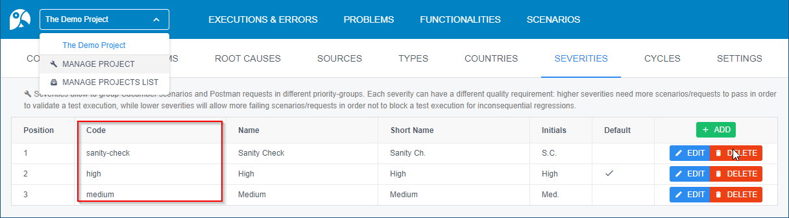
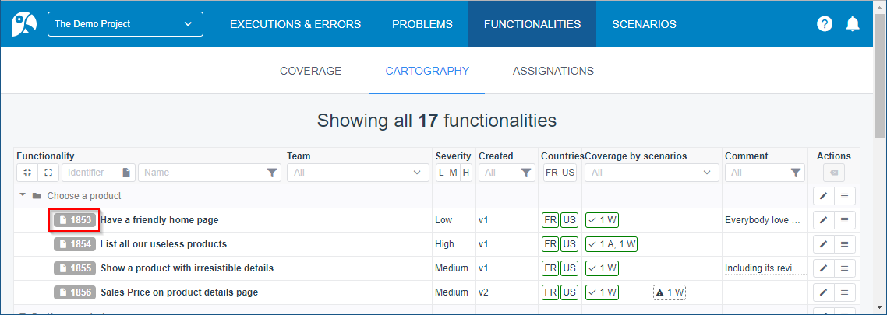
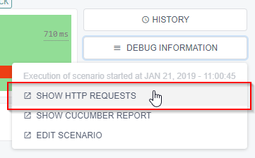
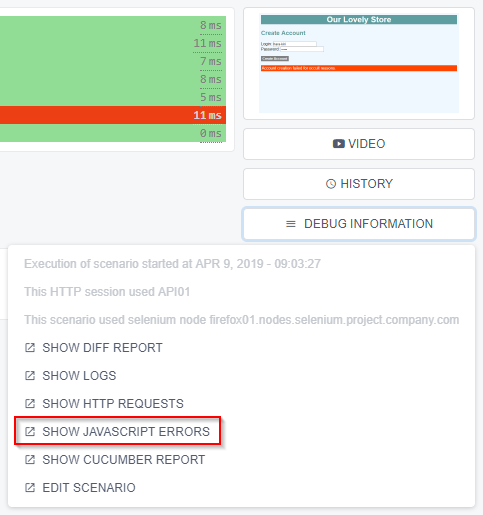
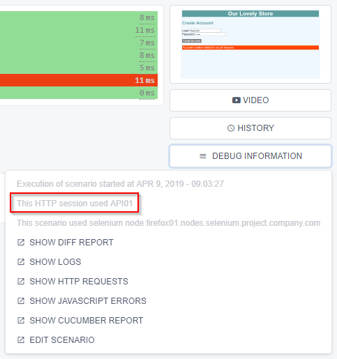

= Embed Cucumber Scenario Meta-Data for ARA

ARA works fine by just uploading the report.json file produced by running Cucumber feature files.

But ARA lets you assign more meta-data to help users discover what's wrong with failed scenarios.

Here is how you can optionally enhance your automated tests with some data ARA will understand:

* <<tags, Tags on Scenarios>>: severity, countries & ignore
* <<name, Scenario Name Prefixes>>: functionalities coverage
* <<embed, Embed Data in Scenario Reports>>: screenshot & video
* <<structured, Add Meta-Data Through StructuredEmbeddings>>: start time, logs, diff reports, used servers

== [[tags]] Tags on Scenarios

=== Scenario Severity

When configuring severities in an ARA project, each severity is assigned a code:


This code can be used as tags in Cucumber scenarios
(or for the whole feature file, so the tag is inherited by all scenarios in that file).

Just tag scenarios with a tag name starting with `@severity-` and ending with the severity code.

For instance, if you have a "Severity Check" tag with code "severity-check",
tag your scenarios with `@severity-severity-check`.

Scenarios will be grouped by severity and be applied different quality thresholds in ARA: +
image:severities-on-executions.png[]

NOTE: You also can place such severity tag at the very beginning of a Postman request or folder name:
if several severities are found down the tree, the deepest one overrides the others.

=== Scenario Supported Countries

If you run tests on several countries (or application configurations), you can tag scenarios with `@country-xx` tags,
where `xx` is a country code: +
image:country-codes.png[]

If a scenario contains `@country-all`, it is then considered to support all countries,
and all other `@country-` tags are ignored.

ARA will make no check if a scenario that ran on one country was or was not intended to run on that country. +
This is up to you to provide the correct parameters to Cucumber for it to execute only the requested countries. +
You can do so with this command-line option: `--tags @country-all,@country-us` (or its equivalent JUnit annotation)
for the US country in this example.

Note: to combine country-selection and ignore-exclusion, use this command-line option:
`--tags ~@ignore --tags @country-all,@country-us` (means "without @ignore AND either with @country-all or @country-us).

Countries are used to compute country-functionality-coverage: +
image:countries-on-functionalities.png[] +
image:countries-on-coverage.png[]

=== Ignored Scenarios

Sometimes, some scenarios are too fragile for them to be run and you do not have too much time to fix them. +
You will be tempted to temporarily ignore them. +
The "temporarily" is the key: without keeping track of which scenarios are ignored,
this "temporarily" can inadvertently become "permanent".

ARA keeps tack of ignored scenarios on the home screen: +
image:ignored-scenarios.png[]

Just use this tag to ignore a scenario:

    @ignore

ARA will gray it out in functionality coverage too.

Then, when running Cucumber, provide this command-line option: `--tags ~@ignore` (or its equivalent JUnit annotation).

NOTE: Newman does not provide any mechanism to ignore some requests, so this tag is not supported for Postman sources.

== [[name]] Scenario Name Prefixes

=== Link Scenarios to Functionalities

When users create a functionality, it gets assigned a unique identifier: +


Users will be able to prepend the functionality to a Cucumber scenario name for functionality coverage to take place: +
image:functionality-on-scenario-name.png[]

Here are examples of supported prefixes:

* `Functionality 42:`
* `Functionalities 42 & 43:`
* `Functionalities 42, 43 & 44:`
* `Functionalities 42, 43 and 44:`

A few human errors or grammatically incorrect wordings are allowed:

* `Functionalities 42:`
* `Functionality 42, 43:`
* `Functionalities 42 & 43, 44:`
* `Functionalities 42 and 43 and 44:`

NOTE: With Postman, users can add functionality identifiers on both requests and folders:
a request inherits all functionalities assigned to it and its parent folders.

== [[embed]] Embed Data in Scenario Reports

Here are some meta-data you can easily embed through the standard Cucumber mechanism.

=== [[embed-screenshot]] Screenshot

ARA displays one screenshot per scenario, if one is found. +
It usually shows the screen as it was after the scenario, if it failed: +
image:screenshot.png[] +
The miniature can be clicked to see the full screenshot.

For a scenario, ARA will extract the first found Cucumber embedding with MIME type "image/png" and save it.

Example of how to take screenshots with Selenium:

```java
@cucumber.api.java.After
public void after(cucumber.api.Scenario scenario) {
    if (scenario.isFailed()) {
        byte[] screenshot = ((TakesScreenshot) seleniumWebDriver).getScreenshotAs(OutputType.BYTES);
        scenario.embed(screenshot, "image/png");
    }
}
```

You can also <<structured-screenshot, embed screenshot via Structured Embeddings>> (as URL instead of bytes array).

=== [[embed-video]] Video

A video is a very helpful debugging tool to take into account when dealing with user-interface testing like Web sites or
heavy clients. +
Sometimes, an error in the middle of a scenario can be uncatched by the scenario, but lead to some data not being
initialized, making one of the last steps of the scenario fail. +
Having a video allows you to debug such tricky cases.

A video is available here on errors: +
image:video-button.png[]

You are in charge of recording the video, uploading it somewhere, and then you will have to provide the video URL with
an `.mp4` extension for ARA to recognize it.

Here is an example of how to embed a scenario video for ARA:

```java
@cucumber.api.java.After
public void after(cucumber.api.Scenario scenario) {
    if (scenario.isFailed()) {
        // Here, upload the video somewhere and compute its URL
        String uploadedVideoUrl = "http://server/video-21546941.mp4";
        scenario.embed(uploadedVideoUrl.getBytes(StandardCharsets.UTF_8), "text/plain");
    }
}
```

You can also <<structured-video, embed video via Structured Embeddings>>
(any file extension will be allowed with this mechanism).

== [[structured]] Add Meta-Data Through StructuredEmbeddings

ARA provide a more elaborate way to embed rich and structured data into Cucumber reports.

=== About Structured Embeddings

When dumping a lot of debug information into Cucumber reports, you end up like this for each scenario: +
image:without-structured-embeddings.png[]

Users cannot distinguish between all these text/plain attachments.
Which one is the video URL? The logs URL? The scenario start date and time? Etc. And these URLs cannot even be clicked.

This is a limitation of how Cucumber embeds are implemented, and plugins like
https://github.com/damianszczepanik/cucumber-reporting[Pretty Cucumber Reports] or
https://wiki.jenkins.io/display/JENKINS/Cucumber+Reports+Plugin[Jenkins' Cucumber Reports Plugin]
try their best to display them in a user-friendly way.

Structured embeddings have two advantages:

* They produce a single human readable HTML into the standard Cucumber HTML reports
  (ran from command line or on continuous integration plugins) with links and video preview: +
  image:with-structured-embeddings.png[]
* They produce a hidden JSON object as a comment in that HTML attachment, for machine tools like ARA to index it and
  show it in a user-friendly way on the ARA's graphical interface.

ARA provides a Java library to build such attachments. +
To create them in other languages, please read the <<StructuredEmbeddingsFormat#head, StructuredEmbeddings format>> to
implement a library. +
We will be happy to include the library in the open-source version of ARA.

=== Usage

In Java, just include the ara-lib library. +
Here is how to find it with Maven:

```xml
<dependency>
    <groupId>com.decathlon.ara</groupId>
    <artifactId>ara-lib</artifactId>
    <version>${ara.version}</version>
</dependency>
```

The following meta-data need to be saved as StructuredEmbeddings for them to be parsed by ARA. +
There is currently no other way to export such data.

Here is how to initialize the embeddings at the start of a new scenario execution, and how to embed all data at the end
of the scenario execution:

```java
private StructuredEmbeddingsBuilder embeddings;

@cucumber.api.java.Before
public void before() {
    // Initialize a new container for this scenario execution
    embeddings = new StructuredEmbeddingsBuilder();
    // Optional, but easy and useful:
    embeddings.addStartDateTime();
}

@cucumber.api.java.After
public void after(cucumber.api.Scenario scenario) {
    // Add all you embeddings here (logs, video, diff reports...)
    embeddings.add(new LinkEmbedding("logsUrl", "Logs", "logs.com", EmbeddingPriority.TECHNICAL_DEBUG_MEDIUM));
    // ...
    // Embed the result in Cucumber reports as HTML content
    scenario.embed(embeddings.build().getBytes(StandardCharsets.UTF_8), "text/html");
}
```

You can embed different kinds of data:

* *TextEmbedding:* embed a simple textual data (HTML is escaped)
* *ObjectEmbedding:* serialize a Java object as a JSON object (it is also shown in the HTML export: to hide it, use EmbeddingPriority.HIDDEN)
* *ImageEmbedding:* embed an URL to an image (only the URL, to not overload reports): the image is displayed in the HTML
* *LinkEmbedding:* embed a clickable link to a URL
* *VideoEmbedding:* embed an URL to a video (only the URL, to not overload reports): the video is playable in the HTML
* *StructuredEmbedding:* you can define your own data types by inheriting this abstract class: just store the data in `Object data` and redefine `toHtml()` to define its HTML representation

See the
link:../../../lib/src/main/java/com/decathlon/ara/lib/embed/producer/StructuredEmbedding.java[StructuredEmbedding's doc]
for a description of all fields.

You basically have two main classes to deal with structured embeddings (see JavaDoc for more information):

* link:../../../lib/src/main/java/com/decathlon/ara/lib/embed/producer/StructuredEmbeddingsBuilder.java[StructuredEmbeddingsBuilder]
  to produce embedding data
* link:../../../lib/src/main/java/com/decathlon/ara/lib/embed/consumer/StructuredEmbeddingsExtractor.java[StructuredEmbeddingsExtractor]
  to consume embedding data

=== Structured Embeddings Recognized by ARA

Most data are provided as URLs, to enable having a light report.json and do not risk having an out-of-memory exception
when running tests or parsing results. +
If you provide such meta-data URLs, you will then need to upload data (logs, screenshots, videos) to a server (using
SSH, FTP, HTTP calls, etc.) and expose the files of this server as HTTP URLs for ARA to be able to display them.

==== [[structured-screenshot]] Screenshot

With regular Cucumber embedding, screenshots are embedded in the report.json file as a byte array. +
They are readable in-place with most HTML report generators, but they make the report very big in size. +
This is especially problematic with an execution having a lot of failures:
Cucumber keeps every screenshots in RAM during execution, and dump them in a report.json at the very end:
this produces a lot of OutOfMemoryExceptions for executions going very wrong.

Screenshots embedded using Structured Embeddings are just URLs to image files stored on another server. +
You are responsible to upload the screenshot, but won't fear any tool in your continuous integration would run out of
memory: your test executions will be solid each time.

Upload the screenshot somewhere, and just provide a URL in a structured embedding with `kind = "screenshotUrl"`:

```java
embeddings.add(new ImageEmbedding("screenshotUrl", "Screenshot", screenshotUrl, EmbeddingPriority.FUNCTIONAL_DEBUG_MEDIUM));
```

You can also <<embed-screenshot, embed screenshot via a regular Cucumber embed>> (as bytes array instead of URL).

==== [[structured-video]] Video

With regular Cucumber embedding, a video is just a text/plain attachment that happens to be a URL in a Cucumber report:
user have to copy/paste this URL in a new tab to view the video. +
With structured embeddings, the video will be playable right in your HTML report.

Upload the video somewhere, and just provide a URL in a structured embedding with `kind = "videoUrl"`.

```java
embeddings.add(new VideoEmbedding("videoUrl", "Video", videoUrl, EmbeddingPriority.FUNCTIONAL_DEBUG_LARGE));
```

You can also <<embed-video, embed video via a regular Cucumber embed>>.

==== Scenario start date & time

This information is displayed for the whole scenario, and is then used to estimate the start of each step: +
image:start-date-time.png[]

ARA approximates the start time of each step of the scenario by adding durations of all previous steps. +
This information is very helpful in order for users to look at the server logs at the time of the scenario to have more
clues about what went wrong.

Create an embedding of `kind = "startDateTime"` and its content having the format `"yyyy.MM.dd-HH'h'mm'm'ss.SSS"`
(example: `"2019.12.31-23h59m59.999"`).

You can copy/paste this code to your project:

```java
@cucumber.api.java.Before
public void before() {
    embeddings.addStartDateTime();
}
```

==== Logs

A scenario can produce or record logs (called methods, Web browser logs, etc.): +
image:logs.png[]

```java
embeddings.add(new LinkEmbedding("logsUrl", "Logs", url, EmbeddingPriority.TECHNICAL_DEBUG_MEDIUM));
```

==== HTTP Requests

When doing API tests, you can log all HTTP requests to a file to link it here: +


```java
embeddings.add(new LinkEmbedding("httpRequestsUrl", "HTTP requests", url, EmbeddingPriority.TECHNICAL_DEBUG_LARGE));
```

==== JavaScript Errors

When doing web-browser tests, you can save JavaScript errors and show them here: +


```java
embeddings.add(new LinkEmbedding("javaScriptErrorsUrl", "JavaScript errors", url, EmbeddingPriority.TECHNICAL_DEBUG_MEDIUM));
```

==== Diff Reports

When comparing two big files, you could produce an HTML report of differing lines, and display it here: +
image:diff-report.png[]

```java
embeddings.add(new LinkEmbedding("diffReportUrl", "Diff report", url, EmbeddingPriority.OUTPUT_LARGE));
```

==== API Server Used in a Scenario

When doing web-browser tests, your HTTP session may be hooked with one of your server's API: display this information here: +


```java
embeddings.add(new TextEmbedding("apiServer", "API server used by this HTTP session", apiServer, EmbeddingPriority.TECHNICAL_DEBUG_SMALL));
```

==== Selenium Node Used in a Scenario

When doing web-browser tests with Selenium Grid, display the Selenium Node that was used by the scenario here: +
image:selenium-node.png[]

```java
embeddings.add(new TextEmbedding("seleniumNode", "Selenium node used by this scenario", seleniumNode, EmbeddingPriority.TECHNICAL_DEBUG_SMALL));
```
