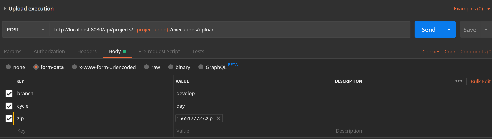

[#head]
= Upload a Postman execution's report on ARA

Once you've got a running version of ARA, you can upload Postman execution's
report in the system. It's highly recommended to read the
<<HowItWorks.adoc#head, How It Works>> part.

== Prepare the report

We recommand to launch your Postman runs using https://learning.getpostman.com/docs/postman/collection_runs/command_line_integration_with_newman[newman].

Once you launch newman, you have to export the result in JSON format. With `newman` you
can easily export the result of your run in a json using the command :
`newman run <collection.json> --reporters cli,json --reporter-json-export report.json`

This report must live in a specific directory architecture which is :
`{TIMESTAMP}/{COUNTRY}/{TYPE}/report.json`

With :

* `{TIMESTAMP}` the timestamp, from the Jan 01 1970, of the moment when the test was
launched.
* `{COUNTRY}` the country code of the country tested by your run (for example `fr` if
your run has tested the France configuration). This country code must be defined in your
project's settings in ARA in the Country tab.
* `{TYPE}` the code of the typology of test this run covers (for example `integ-api`
if your run has tested the Integration of your APIs). This type code must
be defined in your project's settings in ARA in the Type tab.

== Add ARA specific information

You need to create a file name `cycleDefinition.json` and add it to the folder architecture
described above like so : `{TIMESTAMP}/cycleDefinition.json`

For its content, please see the explanation <<HowItWorks.adoc#cycleDefJson, here>>

You also need to add some files which will tells ARA where to find your build information
(build timestamp, build url, version...). The content of this file is described
<<HowItWorks.adoc#buildInfosJson, here>>. Please note that you'll need a `buildInformation.json`
file in each directory in the folder architecture. So you'll have at least :

* `{TIMESTAMP}/buildInformation.json`
* `{TIMESTAMP}/{COUNTRY}/buildInformation.json`
* `{TIMESTAMP}/{COUNTRY}/{TYPE}/buildInformation.json`


We highly recommand that those files (cycleDefinition and all the buildInformation files) should
be generated in a script inside your CI tool (like GitlabCI, or Jenkins) to avoid any errors, and
to retrieve the good information (buildLink, buildTimestamp...) directly in it.

== Send the report

Once all the step above are completed, you should have (at least) the following architecture :

```
{TIMESTAMP}/
   cycleDefinition.json
   buildInformation.json
   {COUNTRY}/
      buildInformation.json
      {TYPE}/
         buildInformation.json
         report.json
```

(Note that you can have several {TYPE} folders and several {COUNTRY} folders for a same {TIMESTAMP},
this is just the minimal expected by ARA).

All you have to do to make ARA analyze it is to zip this folder inside a `{TIMESTAMP}.zip` file
and send it over HTTP to ARA with the following parameters :

|===
| **URL** | `{ara_baseurl}`/api/projects/`{project_code}`/executions/upload
| **HTTP METHOD** | POST
| **CONTENT TYPE** | multipart/form-data
| **BODY PARAMS** | `branch: {{YOUR_CYCLE_BRANCH}}, cycle: {{YOUR_CYCLE_NAME}}, zip: {{YOUR_ZIP_FILE}}`
|===

For example, you can send it with Postman :



Or with the CURL command line :

```
curl \
  -F "branch={{YOUR_CYCLE_BRANCH}}" \
  -F "cycle={{YOUR_CYCLE_NAME}}" \
  -F "zip=@/home/user/Documents/1565177727.zip" \
  {ara_baseurl}/api/projects/{project_code}/executions/upload
```

