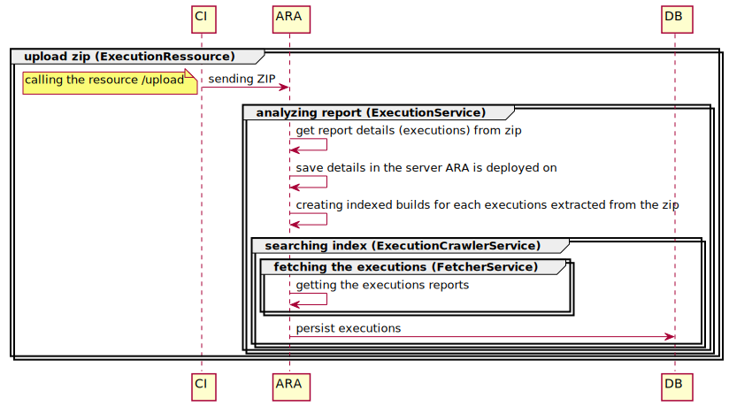

[#head]
# Process from the upload to the fetch

This documentation explains what happens after uploading the zip containing the details about the build.
It is highly recommended to take a look to the <<HowItWorks.adoc#head, How It Works>> section before.

## Uploading the zip

### ExecutionResource.java
-> First step is to upload the zip (https://your-ara-server.org/api/projects/cube-back/executions/upload).

### ExecutionService.java
-> The zip is then unzipped +
-> All the {_cycle and build_} details are extracted from the files contained in the zip +
-> The zip is saved in the server hosting ara (see `Settings.EXECUTION_INDEXER_FILE_EXECUTION_BASE_PATH`) +
-> The builds are then indexed

### ExecutionCrawler.java

-> Choose the fetcher (see below)

### FetcherService.java

This service enables to get the builds details. It can be declined into several strategies, for instance:

* HttpFetcher.java: getting the builds from a remote server
* FileSystemFetcher.java: getting the builds locally

Note that strategies are detected in the runtime. In fact, it is loaded from the configuration when Spring is launched. +
See `FetcherService.get(projectId)`.

-> All the reports details about the builds are fetched.

### ExecutionCrawler.java

-> The builds are persisted to enable ARA to have an history

