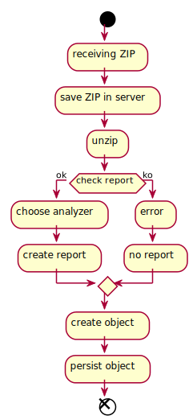

# ARA analyzer refactor

## Introduction

ARA analyzes reports and displays them. It is helpful in order to know if our project is meeting the expected quality.

## The problem

Currently, several issues are noticed when analyzing the report:

* High dependence on code
* The "fetcher"  relies on reflexivity:
** Performance issues
** The relations in the code are unclear
** Can't find usage in the code
** Can't be debugged
* The "fetcher" is redundant and misleading -> we already have "fetched" the build results, when the zip was uploaded
* The "fetcher" is highly dependant on the type of report (here cucumber and postman)

## The solution

The goal here is to come up with a more "intuitive" and independent design.
We want the analyzer to be modular: adding a new analyzer won't affect the whole process.

