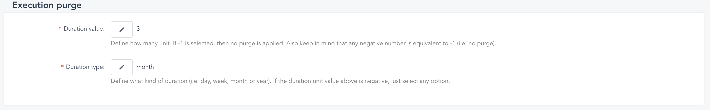

# Purge executions

You may not need to keep years of executions. This operation is useful to keep your database lighter, thus improving performance.

## Set the purge rate
To set the rate you want your purge to happen, fill the field `ara.purge.schedule` in your `application.yaml` file with a cron value.

```yaml
ara:
  purge:
    schedule: "0 0 2 * * *" # every day at 2 A.M.
```

WARNING: The Spring CRON is not exactly like UNIX CRON. Check the https://docs.spring.io/spring-framework/docs/current/javadoc-api/org/springframework/scheduling/support/CronSequenceGenerator.html[Spring documentation] for more details.

WARNING: If the CRON is missing or incorrect, the purge will start 5 minutes after deployment then everyday

## Select the executions lifespan
To select the executions to keep, select the duration value and type. You can find these settings in the `SETTINGS` > `SETTINGS` tab.



IMPORTANT: If the value is -1 (or below), then no purge is scheduled.