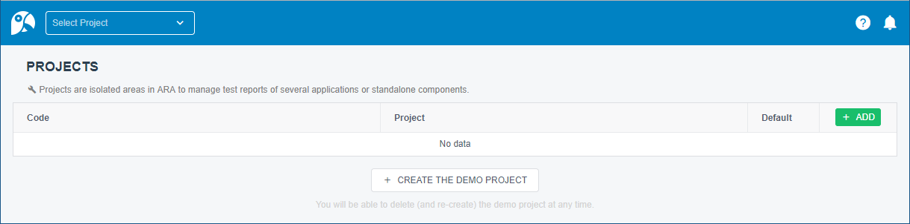
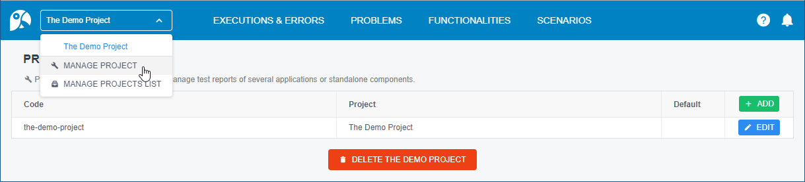
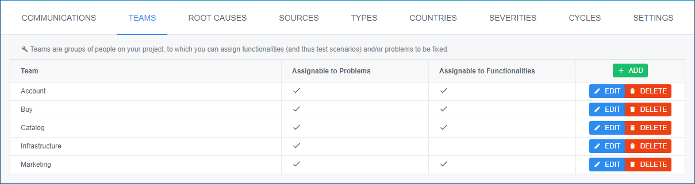
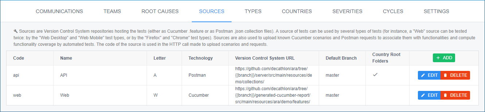
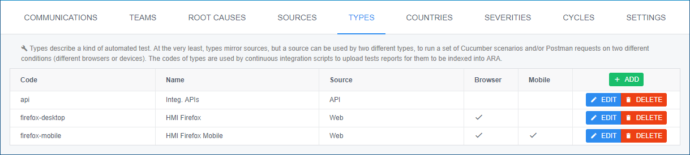
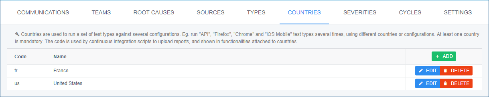
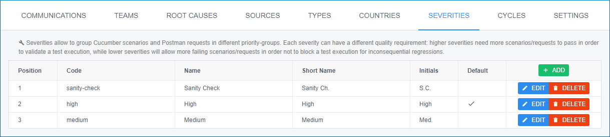
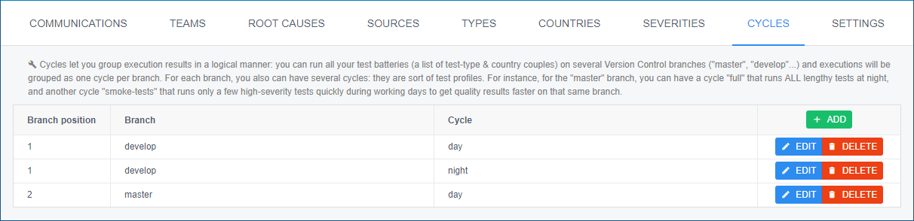
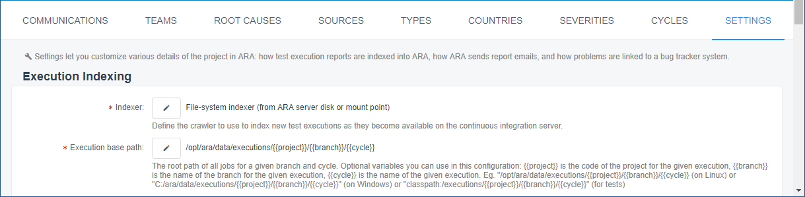

= ARA's Integrator Documentation

Here is how to set up ARA, configure it, and plug the continuous integration of your project onto ARA.

== Enable or Disable an experimental feature

ARA may contain some unstable features, which are still under beta tests, and which are disabled on
Production instances and clones.

You can still enable some of them by using the `<host>:<port>/api/features` HTTP API (see the Swagger
documentation of ARA for more details), but please note that those features are experimental and that
you may encounter unstable behavior if you're using them. If you do, please join a copy of your ARA logs and
the execution context / error in an issue in the project repository, it will help us a lot :)

The features can also be enabled or not directly at the ARA instance startup following this rule :

* the value is set in system property `-Dara.features.<code>=<state>`
* if not, the value is set in the spring application.properties file `ara.features.<code>=<state>`
* otherwise, the value is `false`.

Where `code` is the code of the feature you want to enable. (You can list all available features with
a GET call on `<host>:<port>/api/features`).

Note that a feature state will be stored in your instance memory and not your database, so if you
have 2 ARA instances running on the same database, you can enable a feature on only one instance and not
the other one.

== Configure a Project in ARA

Once ARA is up and running, you will have to set up a project in ARA. +
Projects in ARA are spaces isolated from each other, where all your application test results will get uploaded and reports will be viewable and manipulated by the whole team.

* Go to https://{{your-ara-domain-name}}/#/management/projects +
  
* You can click the `[ + CREATE THE DEMO PROJECT ]` button,
  play with it and its project settings to be more familiar with what an ARA project looks like.
  You can remove and/or re-create the demo project at any time.
* Once you are ready, click the `[ + ADD ]` green button in https://{{your-ara-domain-name}}/#/management/projects to create your own project

Then, to set up the project, select "MANAGE PROJECT" in the top-left project's drop-down list:

Configure each screen: *provide at least one of each of the configuration entities described below*. +
A documentation text is displayed on each screen and each field of the ADD popup dialogs.

* *Teams:* just provide it/them with a name(s): +
  
* *Sources:* source repositories that contain your test files: +
  
* *Test types:* declare the test types that will be executed (a source can be run by several test types): +
  
* *Countries:* they represent different configurations in which your solution will be tested by all (or some of the) declared test types: +
  
* *Severities:* they allow to partition your Cucumber scenarios and Postman requests into groups that can have various level of quality exigences +
  (quality exigences can vary from execution to executions, so the quality threshold of each severity is declared later): +
  
* *Cycles:* configure at least one cycle per source branch on which you run automated tests, and optionally provide more cycles for one or more branches: +
  

Additionally, it is strongly recommended to set up "Email Reports" in the Settings screen. +
You also can configure "Defects" settings to link ARA problems to your bug tracker system: +

Your project is now ready to receive its test reports.

== Send Execution Reports to ARA

If you use want to upload Cucumber reports, just follow the <<../../execution/uploads/UploadCucumber.adoc#head, Upload Cucumber procedure>>

If you use want to upload Postman reports, just follow the <<../../execution/uploads/UploadPostman.adoc#head, Upload Postman procedure>>

== Upload Cucumber Scenarios and Postman Requests to ARA

There is an optional additional step to feed ARA with all data it needs from your project.

=== Why?

If you need:

* the tracking of `@ignore` Cucumber scenarios
* functionality coverage of automated tests
* team association for Cucumber scenarios and Postman requests (through functionalities)

Then, whenever something is pushed on your main/default branch of your version control system,
you will need to upload the Cucumber scenarios and Postman collections to ARA, so ARA can keep track of them.

This is done independently of executions, because executions can run a sub-set of scenarios, or run them several times (one run with `@country-all` + `@country-fr`, and another run with `@country-all` + `@country-us`...) or exclude all the `@ignore` scenarios.

=== How?

If you have several sources, you will need to upload them individually. +
In ARA terminology, a source is a Version Control System (Git...) URL
to a folder containing either `.feature` Cucumber files or Postman collections;
a source can be used several times by different test types
(same `.features` files used by both "Web desktop" and "Web mobile" test types, for instance).

==== How to Upload Collections of a Postman Source?

Zip all you `*.json` collections, while keeping the parent directories.

For instance, you have Postman collections like `src/main/resources/team1/subteamA/collection1.json`,
and the matching ARA source have VCS URL pointing to the folder `src/main/resources` of your project,
then ZIP all JSON collections in this `src/main/resources`.
The ZIP file will then contain a `team1` folder, and a `subteamA` sub-folder, containing the JSON files.

Upload it to:

* URL: `{{ara-domain}}/api/projects/{{project-code}}/scenarios/upload-postman/{{source-code}}`
* HTTP method: `POST`
* HTTP header: `Content-Type: multipart/form-data`
* HTTP body: a form field named `file` with the ZIP file content

==== How to Upload Scenarios of a Cucumber Source?

Run Cucumber with the command-line options `--dryRun --reports json` (or its equivalent JUnit annotations).

This will create a `report.json` without running the scenarios.

Upload it to:

* URL: `{{ara-domain}}/api/projects/{{project-code}}/scenarios/upload/{{source-code}}`
* HTTP method: `POST`
* HTTP body: the `report.json` file

== Going Further: More Meta-Data for Executed Cucumber Scenarios

ARA works fine by just feeding it with a Cucumber `report.json`.

ARA optionally offers you to display more meta-data to help user debug scenarios more easily. +
But you need to modify how you run your Cucumber scenarios and embed special data into the report. +
To do so, please follow this documentation: <<../embed/EmbedCucumberScenarioMetaData.adoc#head, Embed Cucumber Scenario Meta-Data for ARA>>

== Bonus: Custom Cucumber to Allow Several Steps to Fail in a Single Scenario

Sometimes, you need to let several steps of a Cucumber scenario fail.

For instance, a scenario can go through a slow process on a website, and check several information are well displayed at the end. +
You may want each check to have its own Cucumber step for better debugging what information is not displayed correctly. +
By default, Cucumber will stop the scenario at the first failed step. +
If the first check step fails, you then have no idea if the following checks would pass or fail.

You can use this Cucumber fork in order to mark some `@Then` steps as "soft-failures", and allow

https://github.com/slaout/cucumber-jvm

ARA supports this.

As an extra, this fork also enable you to run scenarios in parallel (and not just feature files), and annotate some scenarios to run synchronously.
