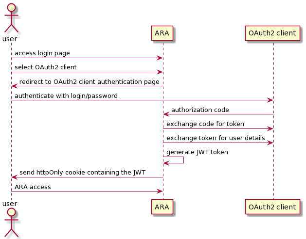
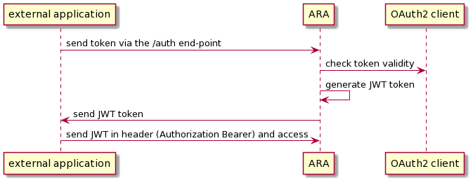
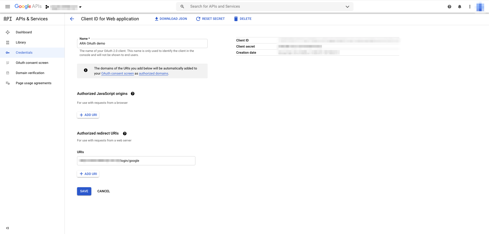
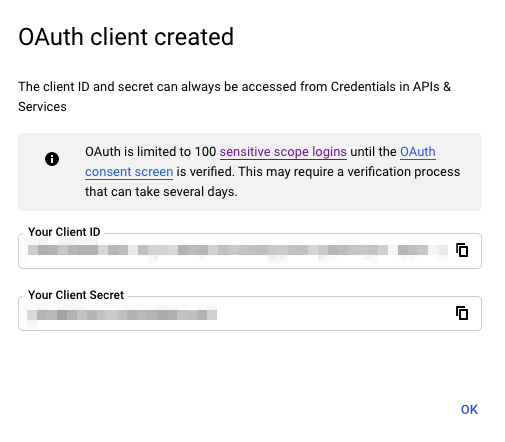
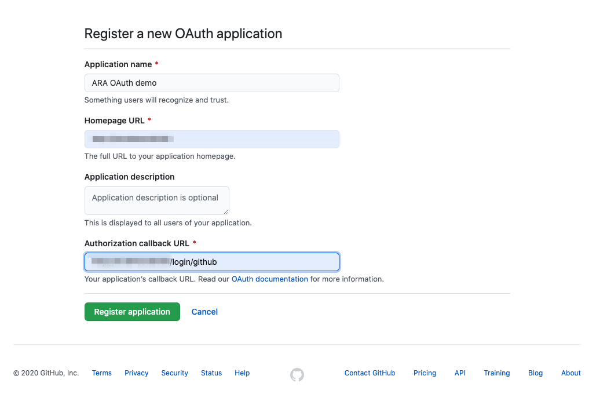
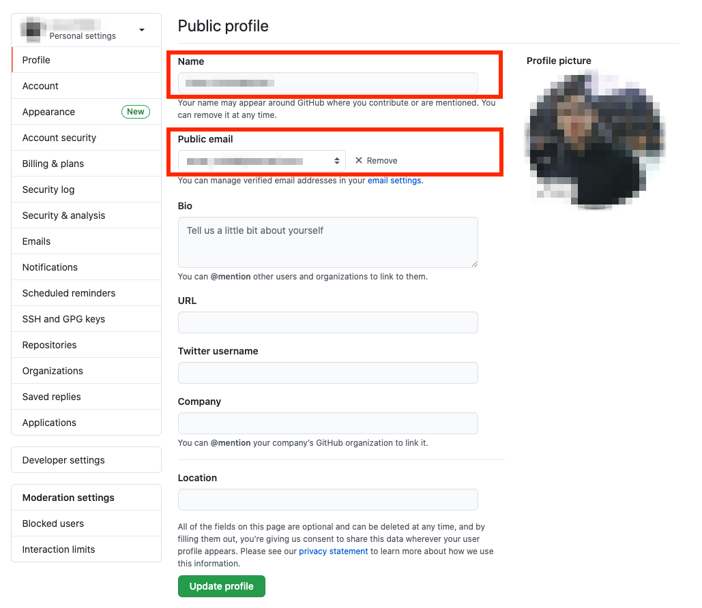
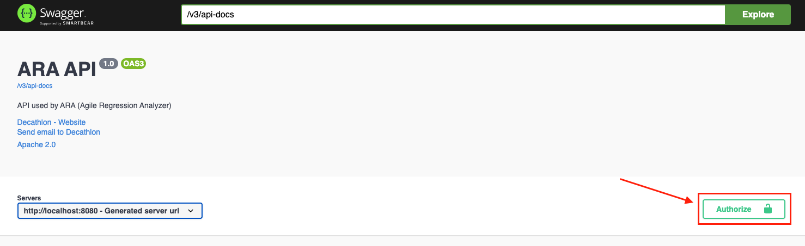
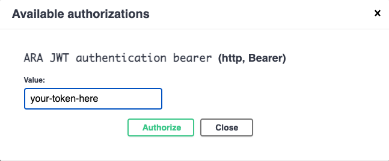

= Authenticate to Ara

== About authentication

Authentication is used to prove one user's identity, and hence controlling access to an application.
However, sometimes an application doesn't want to manage a user account: +
That's why Ara lets its users authenticate using OAuth2. It relies on delegating the user accounts management to a trustworthy third party. +
Once the OAuth2 authentication verified, Ara generates a JWT token, thus letting the user logged in as long as the token is valid.

Ara enables access to *users* (through its front) as well as *applications* (e.g. a continuous integration tool like Jenkins).

=== User authentication flow

To login via OAuth2, Ara needs to trade a code for a token. The code is retrieved after the user has logged in to an OAuth2 login page.
If the code is valid, Ara uses it to get a token, to fetch the user details (such as name or email). In this case a JWT token is created and sent to the user's browser via an httpOnly cookie. +
The user stays connected as long as the token is valid, or has not logged out.

=== Application (non human) authentication flow

Unlike the previous flow, no code is used but rather directly a token. Ara then checks if the token is valid. +
In this case a JWT token is generated and sent as a response. The application can then put it in the header (Authorization Bearer) everytime a resource is consumed.

== User guide

=== OAuth2 credentials
Before configuring Ara, you need to create (if not already done) credentials, such as the client id, secret, redirect uri.

[IMPORTANT]
====
Your redirect uri must follow this pattern => `{{_ara_base_url_}}/login/{{_provider_}}`, where:

* `_ara_base_url_`: as the name suggests, your Ara base url
* `_provider_`: the OAuth provider used. It can be one of the values below:
** `custom`
** `google`
** `github`
====

==== Custom
To create or use custom OAuth2 credentials, please check your company documentation.

IMPORTANT: Keep in mind however that your redirect url must follow this pattern: `{{_ara_base_url_}}/login/custom`

==== Google
. Go to https://console.developers.google.com
. If not, login with the Google account you want to create the credentials with
. Click on `Credentials`
. Click on `Create credentials`
. Select `OAuth client ID`
. Fill in the form in the `Create OAuth client ID` page
.. Select `Web application` in the `Application type` field
.. Add the name you want to give to your OAuth2 client
.. Below the `Authorized redirect URIs`, click on the `Add URI` button to add your redirection uri
+
IMPORTANT: It must follow this pattern: `{{_ara_base_url_}}/login/google`
.. Click on the `Create` button
+

. A popup (`OAuth client created`) containing your client id and secret will appear
+

==== Github
. Go to https://github.com/settings/developers
. If not, login to your Github account
. Click on the `New OAuth App` button
. Fill in the form
.. `Application name`: The name you want your users to see when logging to Ara via Github
.. `Homepage URL`: Just put your Ara base url here
.. Authorization callback URL: where the user should be redirected avec after logging to Github.
+
IMPORTANT: It must follow this pattern: `{{_ara_base_url_}}/login/github`
.. Click on `Register application` when finished
+

TIP: If you want to access and display your name and email, go to your Github https://github.com/settings/profile[profile] and make sure the `Name` field is not empty, as well as the `Public email` field. +
Communicate this to your users, if they want these details displayed in Ara

=== [[manual-workflow]]Manual authentication workflow
To make sure the previous step was successful, you can manually check the authentication flow.

.Manual authentication workflow with examples
[%header]
|===
|Steps |Google |Github |Custom

|Go to the OAuth2 login page
|https://accounts.google.com/o/oauth2/v2/auth/oauthchooseaccount?client_id=xxxxx.apps.googleusercontent.com&response_type=code&redirect_uri=*http://my-ara-url/login/google*&scope=https://www.googleapis.com/auth/userinfo.email&flowName=GeneralOAuthFlow
|https://github.com/login/oauth/authorize?client_id=xxxxx
|Check your company documentation

|Once logged in, you are redirected to the url saved in the settings
|http://my-ara-url/login/google
|http://my-ara-url/login/github
|http://my-ara-url/login/custom

|Copy the code found in this url
|http://my-ara-url/login/google?**code=xxx**
|http://my-ara-url/login/github?**code=xxx**
|http://my-ara-url/login/custom?**code=xxx**

|Call the token API with this code to get the token
a|
. *URL*: POST https://oauth2.googleapis.com/token?client_id=xxxxx.apps.googleusercontent.com&client_secret=my_secret&redirect_uri=http://my-ara-url/login/google&grant_type=authorization_code&code=my_code
. *Header*:
.. `Accept`: `application/json`
a|
. *URL*: POST https://github.com/login/oauth/access_token?client_id=xxx&scope=user:email%20read:user&client_secret=my_secret&code=my_code
. *Header*:
.. `Accept`: `application/json`
|Check your company documentation

|Call the user API with this token to get the user details
a|
. *URL*: GET https://www.googleapis.com/oauth2/v3/userinfo
. *Header*:
.. `Authorization`: `Bearer my-access-token`
a|
. *URL*: GET https://api.github.com/user
. *Header*:
.. `Authorization`: `token my-access-token`
|Check your company documentation

|There is also an API that checks the token validity
a|
. *URL*: GET https://oauth2.googleapis.com/tokeninfo?access_token=my-access-token
a|
. *URL*: GET https://api.github.com
. *Header*:
.. `Authorization`: `token my-access-token`
|Check your company documentation

|===

=== Front authentication
After setting up your OAuth2 credentials, you can now configure your front authentication, i.e. :

* For each OAuth2 provider you want to use, enable it and then add the credentials previously set up
* For any provider you do not want to use, you can simply disable it
* You can also disable the whole front authentication (*not recommended* for production environments!)

To do so, create your environment variables:

. Create a `.env` file (in the `code/web-ui` folder root)
. In the same folder, copy the `.env.example` contents in it.
. You can now replace the copied values with the right values

Here are what your `.env` file should contain:

. General:
.. `*AUTHENTICATION_ENABLED*`: this field is to set to `true` if you want to enable the front authentication.
+
WARNING: Please, note that if all the providers are disabled, then the authentication is disabled as well, even if it is set to `true`.
. Custom: It concerns your custom configuration (e.g. matching your company's settings)
.. `*CUSTOM_OAUTH_PROVIDER_NAME*`: the name displayed, it can be your company name. By default it's `Custom` if left empty
.. `*CUSTOM_OAUTH_PROVIDER_CLIENT_ID*`: the client id
.. `*CUSTOM_OAUTH_PROVIDER_URI*`: the login page uri to get the code
.. `*CUSTOM_ENABLED*`: `true` if you want to use it
. Google:
.. `*GOOGLE_CLIENT_ID*`: the Google client id. It should look like `_xxxxxxxxxx.apps.googleusercontent.com_`
.. `*GOOGLE_REDIRECT_URI*`: As seen previously, it must match this pattern: `_{{your_ara_base_url}}/login/google_`
.. `*GOOGLE_ENABLED*`: `true` if you want to use it
. Github:
.. `*GITHUB_CLIENT_ID*`: the Github client id
.. `*GITHUB_ENABLED*`: `true` if you want to use it

=== Back authentication
Like the front authentication, you can configure the back authentication as well. To do so:

. Create the file `code/api/server/src/main/resources/application-auth.properties`. Note that this file is ignored, preventing you from submitting your credentials by mistake
. Copy the example file (`code/api/server/src/main/resources/application-auth.properties.example`) content in the newly created file
. Replace the values with your real credentials. Each field is described below

TIP: You can also pass the values as parameters (*highly recommended* on production environment, especially for sensitive data related to authentication!).

* *Authentication enabling*:
** `*authentication.enabled*`: enable (`true`) or disable (`false`) the back authentication.
+
WARNING: You have to explicitly set it to true to enable the authentication,  If left empty, it is considered disabled
* *OAuth2 providers*:
** *Github*:
*** `*authentication.clients.github.client-secret*`: the Github client secret
** *Google*:
*** `*authentication.clients.google.client_secret*`: the Google client secret
** *Custom*:
+
****
The custom configuration is divided into 3 main parts: token, user and token validation. Each part is itself divided into: +

* *Request*: +
It describes how to request the data (uri, HTTP method, header and body). +
The header and body contain a list of name and value pairs, separated by a comma `*,*`. Each pair are split by pipes `*|*`. It also supports variables in some cases, and represented this way -> `{{variable_name}}` +
For instance, let's assume we want our header to contain: +
-> `Authorization`, containing a Bearer with a token (the variable is named `token_value`) +
-> `Cache-Control`, with the value `no-cache` +
The value is then: `Authorization,Bearer {{token_value}}|Cache-Control:no-cache` +
* *Response*: +
It describes where to get the expected values in the returned object, by matching the corresponding field names.
****
*** *Token*: +
This part contains the configuration required to fetch the token
**** *Request*: +
You can use *code* `{{code}}` and *client id* `{{client_id}}` variables in the body and/or header
***** `*authentication.clients.custom.token.uri*`: the token API uri
***** `*authentication.clients.custom.token.method*`: the HTTP method used to get the token.
+
IMPORTANT: Only `GET` and `POST` method accepted. If left empty, the default value is applied, i.e. `GET`
***** `*authentication.clients.custom.token.header-values*`: all the header values
***** `*authentication.clients.custom.token.body-values*`: all the body values
**** *Response*:
***** `*authentication.clients.custom.token.fields.id*`: the token *id* field name
***** `*authentication.clients.custom.token.fields.access*`: the *access* token value field name
***** `*authentication.clients.custom.token.fields.refresh*`: the *refresh* token value field name
***** `*authentication.clients.custom.token.fields.expiration*`: the *expiration* token field name
***** `*authentication.clients.custom.token.fields.type*`: the token *type* field name
***** `*authentication.clients.custom.token.fields.scope*`: the token *scope* field name
*** *User*: +
This part contains the configuration required to fetch the user
**** *Request*: +
You can use *token type* `{{token_type}}` and *token value* `{{token_value}}` variables in the body and/or header
***** `*authentication.clients.custom.user.uri*`: the user API uri
***** `*authentication.clients.custom.user.method*`: the HTTP method used to get the user.
+
IMPORTANT: Only `GET` and `POST` method accepted. If left empty, the default value is applied, i.e. `GET`
***** `*authentication.clients.custom.user.header-values*`: all the header values
***** `*authentication.clients.custom.user.body-values*`: all the body values
**** *Response*:
***** `*authentication.clients.custom.user.fields.id*`: the user *id* field name
***** `*authentication.clients.custom.user.fields.name*`: the user *name* field name
***** `*authentication.clients.custom.user.fields.login*`: the user *login* field name
***** `*authentication.clients.custom.user.fields.email*`: the user *email* field name
***** `*authentication.clients.custom.user.fields.picture-url*`: the user *picture url* field name
*** *Verification*: +
This part contains the configuration required to check the token validity
**** *Request*:
***** `*authentication.clients.custom.token-validation.uri*`: the token validation uri
***** `*authentication.clients.custom.token-validation.method*`: the HTTP method used to check the token validity.
+
IMPORTANT: Only `GET` and `POST` method accepted. If left empty, the default value is applied, i.e. `GET`
***** `*authentication.clients.custom.token-validation.header-values*`: all the header values
***** `*authentication.clients.custom.token-validation.body-values*`: all the body values
**** *Response*: +
When checking a token, if the API returns: +
=> an error code, or threw an exception, then the token is not valid +
=> a 2xx code, then it is enough to assume its validity, in some cases.
However, sometimes the verification also requires to check a value in the returned object. In this scenario, fill the fields below:
***** `*authentication.clients.custom.token-validation.validation-field.name*`: the field name to look up to check the token validity
***** `*authentication.clients.custom.token-validation.validation-field.expected-value*`: +
=> if left blank, it assumes that the value is a boolean (or a string representing a boolean, i.e `"true"` or `"false"`). For instance lets assume the field name is `active`, then the token is assumed to be valid iff `active` equals `true` (or `active` equals `"true"`). +
=> if a value is given, then this value is compared to the value returned: iff there are the same, then the token is considered valid
+
IMPORTANT: The configurations below are not mandatory. There are used to get the remaining time (in second) for an OAuth2 token to expire: the JWT generated token cannot exceed this duration.
***** `*authentication.clients.custom.token-validation.validation-field.remaining-time*`: the field to get the token expiration remaining time (expected to be in second) *(_optional_)*
***** `*authentication.clients.custom.token-validation.validation-field.expiration-timestamp*`: the field to get the token expiration timestamp (expected to be in second) *(_optional_)*
* *JWT*:
** `*authentication.jwt-token.using-https*`: `true` if Ara is deployed in an HTTPS environment (_**highly recommended** on production environment_)
** `*authentication.jwt-token.token-secret*`: the secret with which the JWT token is created or verified.
+
****
It goes without saying that: +
=> this field is *mandatory*, +
=> the more *complex* and *longer* the secret is, the better, +
=> as the name suggests, it must remain *unknown* at any cost!
****
** `*authentication.jwt-token.access-token-expiration-in-second*`: your token validity duration (in seconds).
+
IMPORTANT: Please note that the JWT token generated by ARA cannot last longer than the OAuth2 token used to authenticate. In the case the OAuth2 token doesn't contain any details about its expiration, then this field is *mandatory* (if a token has a duration of 0 second, then it's not valid!)

==== Swagger
To use the Swagger, there are 3 options:

. Disable the back authentication
+
WARNING: *Dangerous* in a production environment, to be avoided!
. Login to Ara front before. Indeed, the cookie created is used to authenticate every API call.
. Authenticate to Swagger. To do so:
.. Get the token <<manual-workflow, manually>> 
+
IMPORTANT: To login via Google, use the email scope (`https://www.googleapis.com/auth/userinfo.email`) -> the email must be verified: to check if it's the case, Ara requires this scope to get this details!)
.. Call this resource `/auth` with your provider (`custom`, `github` or `google`) and the token you just fetched
+
[source,json]
----
{
    "token": "my-token",
    "provider": "custom"
}
----
.. If successfully authenticated, copy the token returned
.. In Swagger, click on the `Authorize` button
+

.. Copy this token in the `value` field in the popup
+

.. Click on the authorize button
.. You are now authenticated, you can use Swagger resources
+
IMPORTANT: After the token expiration, you'll need to re-authenticate

=== Authentication combinations
There are 4 possible authentication combinations:

.Authentication combinations
[%header]
|===
|Front |Back |Comment

a| * [ ] disabled
a| * [ ] disabled
|*No authentication at all*: useful for demos, to discover Ara (sandbox)

a| * [x] enabled
a| * [ ] disabled
|*Only front authentication*: useful if you only want to focus on developments related to front authentication

a| * [ ] disabled
a| * [x] enabled
a|*Only back authentication*: useful if you only want to focus on developments related to back authentication

WARNING: Keep in mind that you can't use the front: the back is expecting an authentication token but the front is not sending any!

a| * [x] enabled
a| * [x] enabled
|*Full authentication*: use this for production environment

|===

== Further reading

. https://tools.ietf.org/html/rfc6749[OAuth2]
. https://tools.ietf.org/html/rfc7519[JWT]
. https://cheatsheetseries.owasp.org/cheatsheets/HTML5_Security_Cheat_Sheet.html[OWASP Cheat Sheets]