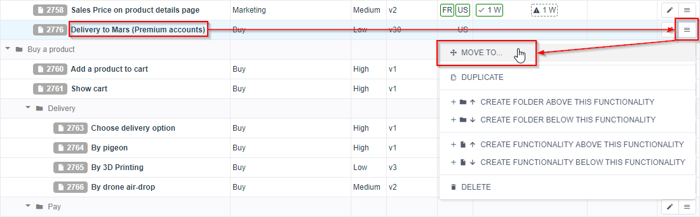
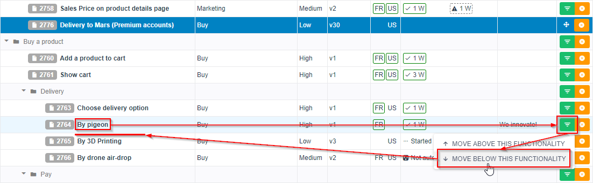

= Create and Move Functionalities

Here is how to create or reorganize functionalities in ARA.

There is no drag and drop management yet, but thankfully, there is a simple logic to follow in both creating and moving
functionalities and folders.

Let's say you have the following structure, and you want to move "Delivery to Mars" in the "Delivery" folder, between
"By pigeon" and "By 3D Printing":

image:intention.png[]

Open the menu of the functionality to be moved ("Delivery to Mars") and choose "MOVE TO..." :

The line "Delivery to Mars" is now deep blue colored, to mean it's the one that is to be moved soon... +
We want it moved just below "By pigeon", so we click the green menu-arrow icon on that destination and choose
"MOVE BELOW" to move the deep-blue selected functionality below the one we just clicked its green menu icon:

Same goes when creating a functionality or a folder.

More generally:

1. select the *source* to move,
2. select the *target* onto which to move the source,
3. select *where to move the source, relative to the target*: above, below, or inside a folder
   (will be appended at the end of the folder's children):

The orange-cross icon is just to cancel the move action:

image:cancel.png[]

It is available on all lines to be reachable quickly from anywhere.

Creation follows the same principle:

image:create.png[]

WARNING: Be careful when creating a folder (or even a functionality) while some filters are active.
         The newly created folder will likely not be visible because it will not match filters.
         Most filters only apply to functionalities: teams, countries, etc.
         Folders cannot have such values, so they do not match filters and are thus hidden.
         However, folders containing functionalities matching the filters are visible.
         Thus, after having added a folder, you have to clear the filters to see the new folder,
         then add new functionalities in it, ensuring that new functionalities will match the filters,
         and then you can apply the filters again: your new folder will be visible, alongside its children
         functionalities.
