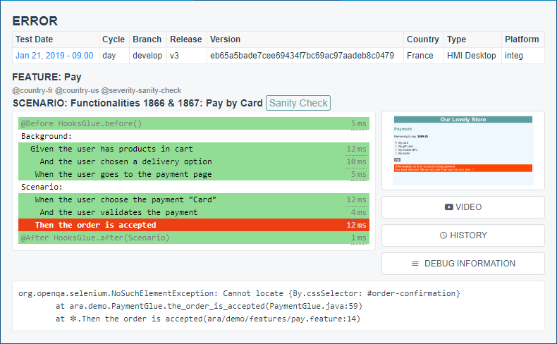
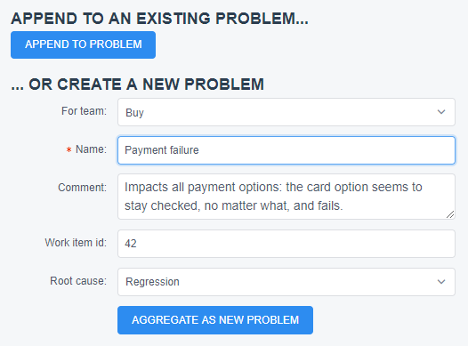
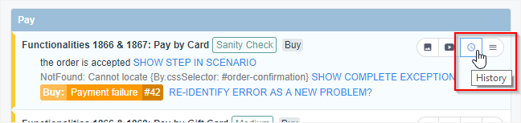
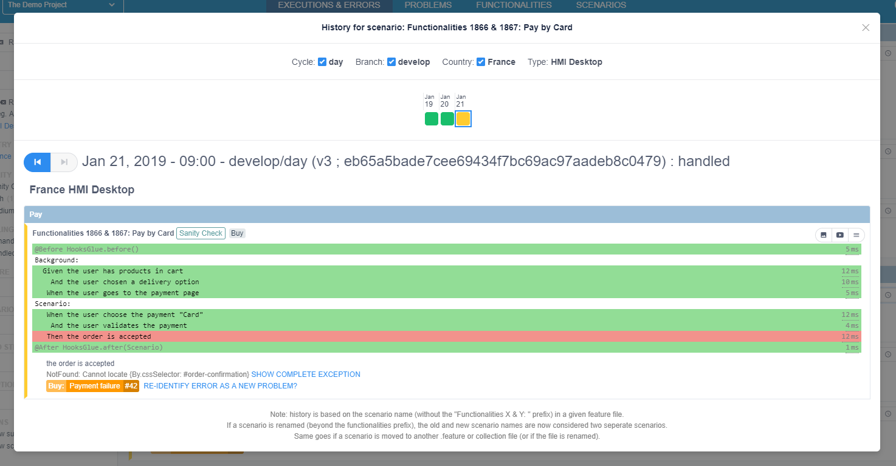
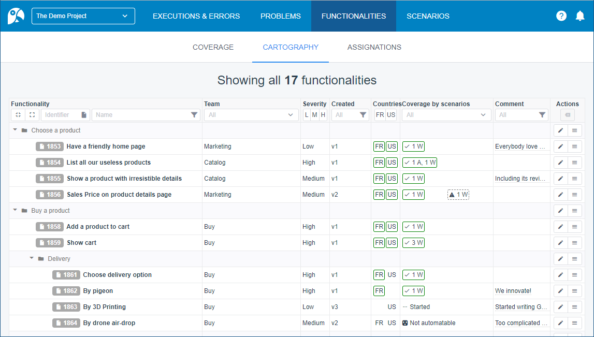

= ARA's User Documentation

== What is ARA and how does it work?

It stands for Agile Regression Analyzer. +
It is an easy-to-use way to track and monitor your software quality. +
It is designed as a "rules engine"/"expert system" type of application. +
You design rules to link a lot of technical errors to only a few business problems with known defects. +
On next non-regression-tests execution, known problems are automatically re-identified, and new errors are highlighted. +
The tool reduces your work load, so you can focus on new errors. +
It also synchronizes team efforts to increase your project quality.

== Basic Concepts

* *ARA:* ARA helps your team to manage the results of your project's automated-non-regression-tests.
* *CYCLES:* Non-regression-tests are organized in isolated cycles with different purposes. For instance:
  - *develop/day:* quickly execute basic tests at each commit on the develop branch
  - *develop/night:* execute complete test-suite at night for the develop branch (can take a long time)
  - *master/night:* execute complete test-suite at night for the master branch
* *EXECUTIONS:* A given cycle is executed regularly: each execution can run several test types, and aggregate all results to gives you a quality status.
* *TEST-TYPES:* you can run API tests with Cucumber, Postman or Karate; and Web desktop or Web mobile tests with Cucumber:
    - RestAssured API with Cucumber
    - API with Postman
    - Karate API with Cucumber
    - Firefox desktop with Selenium & Cucumber
* *QUALITY-STATUSES:* all Cucumber/Karate-scenarios and Postman requests are assigned a severity: a threshold is configured for each severity of each cycle. If a severity quality is below thresholds, the cycle is considered FAILED.
* *SCENARIOS/REQUESTS:* scenarios are the base unit of test: they can all be executed independently, in any order (with dependencies).
* *SEVERITY:* each scenario and request is assigned a severity (if not, the default one is used): higher severities have a stricter threshold and less failures are allowed for these severities:
            depending on your project, severities can have the same thresholds: in this case, severities helps priorize regression fix actions.
    - *Sanity-check:* (eg. on the develop/day cycle, 90% of scenarios must pass for the cycle execution to be successfull)
    - *High (the default severity):* (eg. on the develop/day cycle, 85% of scenarios must pass for the cycle execution to be successfull)
    - *Medium:* (eg. on the develop/day cycle, 80% of scenarios must pass for the cycle execution to be successfull)
* *STEP:* one line of a Cucumber scenario (a `Given`, `When`, `Then`, `And`...) or an assertion in a Postman Test Script

== Overview of ARA Screens & Features

The home screen of ARA displays the latest executions of automated tests on the main branches.

The executions are grouped by cycles, some of which may be a sub-set of all test scenarios,
to make a build eligible (or not) faster than having to run all scenarios.

It is possible to browse for previous executions of each cycle context.

Acceptance quality-thresholds are set by the integrators who configured the execution of the cycles for this project.
Project administrators can allow a small percentage of scenarios to fail on your project.
We recommend that tolerances should be lower on development branches than on production or near-production branches.
This allows some margin to cope with false problems like a slow network,
test scripts not updated yet to reflect a modified screen...

It is also possible to sort scenarios by severity: each severity group has its own acceptance thresholds depending on
the importance of their scenarios, allowing to have higher exigences for high-value and critical tests. +
For this purpose, Cucumber scenarios (or whole .feature files) can have the tag "@severity-" followed by one of the severity codes configured for the project (eg. "@severity-high" for the "High" severity).
The same sort of tag can be used in Postman query names: just make sure this pseudo-tag is at the very start of the request name, or one of its parent folders (if several are defined in parent-folders and request names, the deepest severity overrides the parent ones).

Any actor of the project can see at a glance if a release is eligible to go to the next step of the continuous integration chain,
depending on the automated tests results.

image:home.png[]

In the results of the above example, the orange part is test scenarios failing for an already identified reason, waiting to be fixed by
developers. The red part shows new errors, never seen nor identified before, waiting to be qualified by QAs.

It is easy to see which failures need to be analyzed, with the possibility to filter by various criteria
(by affected team, already identified errors or not, test variants...):

image:execution.png[]

When clicking on a failure to identify (one of the red buttons "IDENTIFY ERROR AS A PROBLEM" above),
all details are shown (scenario, exception, screenshot, video, scenario history, logs...
are available through the buttons on the right of the capture below):

From here, we can create an aggregation rule by checking criteria. The goal is to create a rule that will recognize all
similar errors, past, present AND futures.

Here, search criteria matched nine failed tests:

image:create-problem.png[]

When the criteria are broad enough to encompass all errors/symptoms with the same cause,
but not too broad to not encompass other unrelated errors, you can validate by creating a problem
(or append the new criteria to an existing problem):

On validation of these criteria, a problem is created, associated to a defect on a bug tracker, and the problem will
automatically be recognized (orange instead of red), from present, past and future executions,
no matter the scenario, country, test type, etc., as long as the defined criteria are met:

image:recognized-errors.png[]

There is an execution history for each scenario, allowing to put execution results in perspective: from when does it
fail? Was it always failing for the same reason? Does it fail on other configurations of the solution (other
countries of the same website...)?

You can uncheck the filter checkboxes on top of the history popup to broaden your view of the history of the scenario:
by un-checking the cycle name, you will know if the same scenario fails or pass on other cycles,
same for branch and country...

image:history-filters.png[]

ARA also lets you list all functionalities of your application.
It lets you link your test scenarios with such business functionalities.

Scenarios are automatically assigned to these functionalities.
This offers the benefit of real-time feature coverage of automated tests:

image:coverage.png[]

== Play With the Demo Project

You can find more information with the
link:../../demo/DemoWalkthrough.adoc[Demo Walk-Through]:
follow a typical user journey to understand how to exploit automated tests results with ARA,
with concrete examples.
