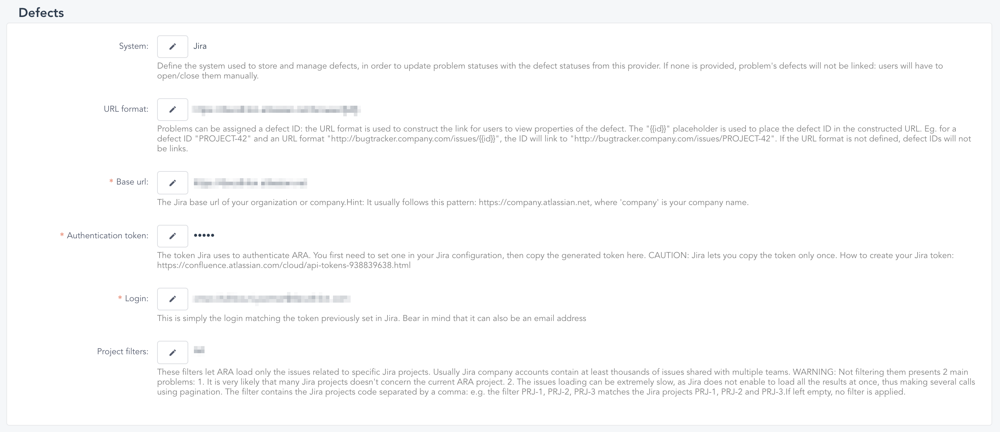

= Jira problems management

== How to use Jira in ARA ?

To use Jira in ARA, you'll need to:

. Go to the settings page (projects/`_your-project-code_`/management/settings).
. In the *Defects* section, choose `Jira` as your system.
. Fill in the form:
.. *URLS*:
... The `URL format` is the Jira URL pattern that links the Jira web page containing a specific issue details. +
Given an issue, whose key is `PRJ-123`, and the Jira homepage being `https://your-company.atlassian.net/`, you'll generally find the issue details here: `https://your-company.atlassian.net/browse/PRJ-123`. +
The value to fill would then be `https://your-company.atlassian.net/browse/{{id}}`, to match any Jira issue keys.
... The `base url` field contains the Jira REST API base url, for instance `https://your-company.atlassian.net`.
.. *Authentication*: +
ARA authenticates to Jira by using tokens. +
To do so, you'll need to create one. You can do it https://id.atlassian.com/manage-profile/security/api-tokens[here]. If it's not straightforward enough, this https://confluence.atlassian.com/cloud/api-tokens-938839638.html[page] shows you how. +
... Copy the generated token in the `authorization token` field
... Copy the login used to create this login in the `login` field. Note that it can be an email address
.. *Filters*: +
A Jira company account usually contains at least thousands of issues. Furthermore, there is a threshold set by Jira that doesn't allow to load all the issues at once, but rather call the Jira REST API multiple times, using pagination. For a large data set, it's needless to say that it can result in poor performance. +
That's why, it is more than advised to filter on the projects you _actually_ use.
... The `project filters` field lets ARA load only the issues concerned by specific Jira projects. +
For instance, given the project `PRJ-1`, `PRJ-2` and `PRJ-3`, the filter value would be `PRJ-1,PRJ-2,PRJ-3` (or `PRJ-1, PRJ-2, PRJ-3`, whitespaces are allowed for readability) +
-> If left empty, no filter is applied, but it's not advised.

WARNING: If your project handles its problems with other defect adapters (such as `RTC` or `Github`), you won't be able to access its issues or see the defects status (i.e. `OPEN` or `CLOSED`).

